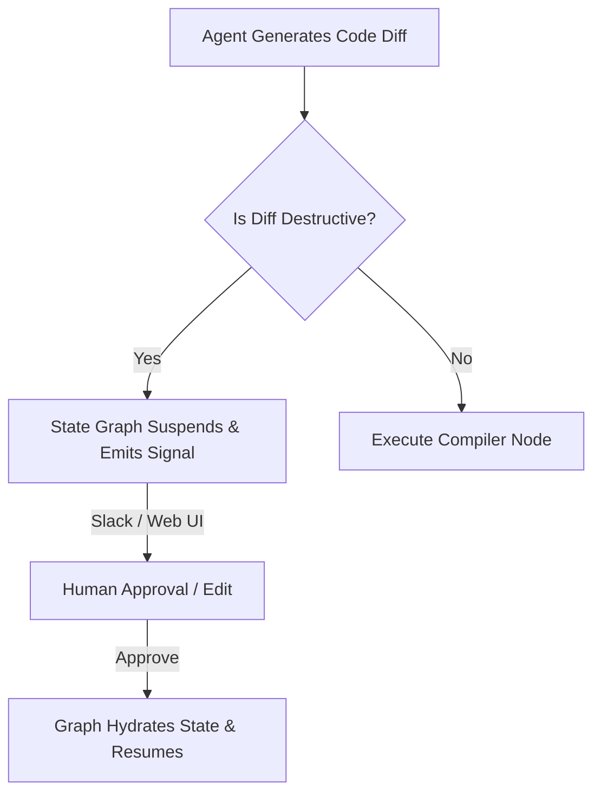

# 🔄 Agentic Workflows: State Machines & Durable Execution

## 🌌 The 2026 AI Agent Landscape
Simple sequential chains are brittle and fail to recover from runtime errors. Production-grade agents are designed as **Stateful, Cyclic Directed Graphs** (State Machines) and robust, distributed workflows. Building complex multi-agent architectures requires combining the flexibility of LLMs with the absolute determinism of state graphs, edge routing, memory persistency, and durable transactional execution.

---

## 🗺️ Core Curriculum & Architectural Deep Dives

### 1. LangGraph State Management & Reducer Semantics
In LangGraph, agents share a single central state schema. Rather than overwriting state variables arbitrarily, we use **Reducers** (inspired by Redux state management) to govern state mutation transitions.

#### 🛠️ Python Implementation: Stateful Message Appender Reducer
Here is how to define a thread-safe message-appending reducer that merges token usage metrics and preserves chat histories without losing historical context:

```python
from typing import Annotated, TypedDict, List, Dict, Any
import operator

# The standard 'operator.add' reducer automatically appends elements to a list
# Here we define a custom reducer that merges token logging metadata alongside messages
def token_aware_message_reducer(
    current_state: List[Dict[str, Any]], 
    incoming_updates: List[Dict[str, Any]]
) -> List[Dict[str, Any]]:
    """
    State Reducer that merges incoming messages and aggregates token usage.
    """
    merged = list(current_state)
    for update in incoming_updates:
        # If the update represents an overwrite, replace it
        if update.get("overwrite", False):
            merged = [msg for msg in merged if msg["id"] != update["id"]]
        merged.append(update)
    return merged

# Define the State Schema utilizing Pydantic / Annotated Types
class AgentState(TypedDict):
    messages: Annotated[List[Dict[str, Any]], token_aware_message_reducer]
    current_agent: str
    compilation_attempts: int
    system_errors: List[str]
```

---

### 2. The Saga Pattern for Multi-Step Agent Operations (Temporal.io)
When a coding agent executes commands across multiple files (e.g., editing, building, committing), a failure mid-operation leaves the codebase corrupted. In classical distributed databases, this is solved by transactions. In microservices and AI agent flows, we use the **Saga Pattern**:

```
[Agent Task] ---> [Edit file client.py] ---> [Edit file app.py] ---> [FAIL]
                                                                        |
                                                                        v (Compensating Actions)
[Success]   <--- [Rollback client.py]   <--- [Rollback app.py] <---------+
```

* **Concept**: For every forward action the agent executes (e.g., `modify_file`), we register a **Compensating Action** (e.g., `restore_backup_file`).
* **Implementation**: We wrap the LangGraph cycle inside a **Temporal.io Workflow**. Temporal guarantees that even if the host machine running the agent loses power, the workflow state is preserved in the database. When the server recovers, the workflow resumes from the exact checkpoint and executes the compensating rollback steps to maintain system consistency.

---

### 3. Human-in-the-Loop Interruption Topologies
To build trustworthy automation, we introduce **Human-in-the-Loop (HITL)** gates.



* **Dynamic State Editing (Time Travel)**:
  By persisting state checkpoints after every node execution in a SQLite database, users can inspect the complete execution graph, rewind the thread to step $T-3$, modify the state variables manually (e.g., correcting an LLM's faulty tool argument), and resume execution down a different path.

---

## 🛠️ Practical Drills & Competency Benchmarks

- [ ] **Drill 1**: Build a raw Python State Graph compiler using only functions, conditional edges, and dictionary states (no frameworks). Assert loop-prevention thresholds.
- [ ] **Drill 2**: Implement a LangGraph state schema that manages a multi-agent coding cycle: Coder modifies a file, Tester validates, and if compile errors are detected, a conditional edge loops back to the Coder.
- [ ] **Drill 3**: Create a SQLite-backed checkpoint database in Python, run a state graph, halt it midway, edit a state variable inside the database, and verify that the graph resumes using the modified state successfully.
- [ ] **Drill 4**: Outline a comprehensive Temporal.io workflow in pseudo-code that handles agent execution, tracking active Saga compensation rollbacks if a terminal compilation error occurs.
