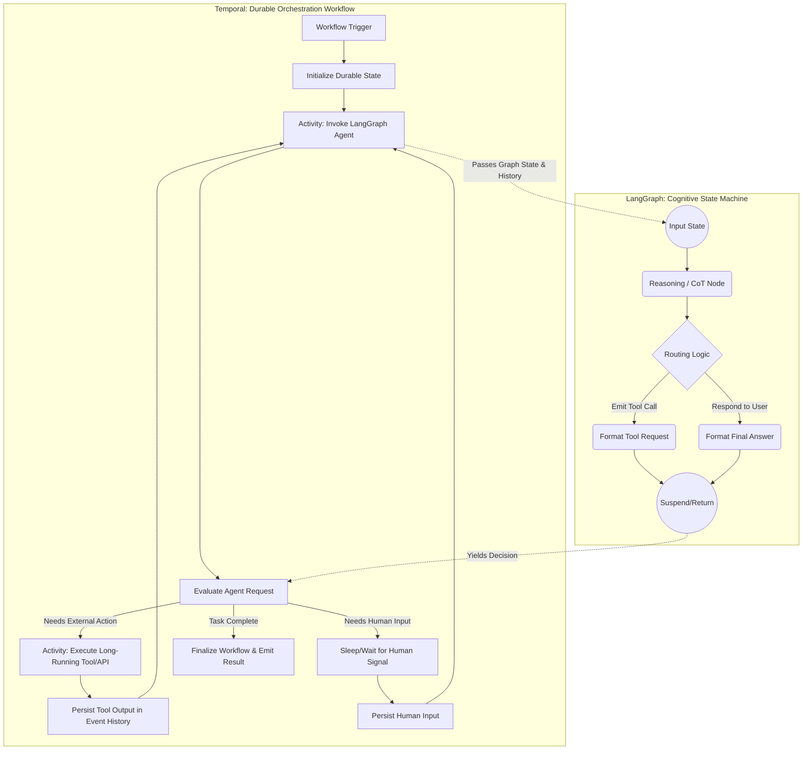

# Advanced Agentic Workflows: 2026 Applied AI Engineer Curriculum

## Introduction and Motivation

The transition from simple prompt engineering to robust, stateful agentic workflows represents the most significant paradigm shift in AI engineering of the mid-2020s. By 2026, the industry has universally recognized that raw large language models (LLMs) are merely non-deterministic, stateless reasoning engines. To deploy them in mission-critical, real-world applications—such as autonomous software engineering, asynchronous financial auditing, or dynamic cloud infrastructure management—engineers must scaffold these models with rigorous mathematical frameworks, durable distributed orchestration, and defensive programming techniques. 

This curriculum provides an exhaustive, textbook-grade foundation for the modern Applied AI Engineer. It covers the theoretical underpinnings of agentic reasoning, the architectural paradigms necessary for scalable orchestration, the operational failure modes encountered in production, and the seminal literature required to build fault-tolerant agentic systems.

---

## Part I: Mathematical Foundations of Agentic Reasoning

### 1. Chain of Thought (CoT) as Inference-Time Compute Scaling
Historically, generative language models were formulated as direct, single-step mapping functions $f: X \rightarrow Y$. The introduction of Chain of Thought (CoT) shifted the paradigm toward dynamically scaling **inference-time compute**. Mathematically, CoT models the generation of a final answer $y$ given an input $x$ through a sequence of latent intermediate reasoning steps (or internal "thoughts") $z = (z_1, z_2, ..., z_k)$.

The conditional probability of the final answer is marginalized over all possible latent reasoning paths:
$$P(y | x) = \sum_{z \in \mathcal{Z}} P(y | z, x) P(z | x)$$

In practice, exhaustive marginalization over the discrete latent space $\mathcal{Z}$ is mathematically intractable. Consequently, inference engines approximate this using beam search, consensus decoding (Self-Consistency), or majority voting over $N$ sampled reasoning paths:
$$\hat{y} = \arg\max_{y} \sum_{i=1}^N \mathbb{I}(f(x, z^{(i)}) = y)$$
where $z^{(i)} \sim P(z | x)$ are independently sampled reasoning traces. In 2026, inference-time compute is treated as a dynamic budget, allocating longer $z$ sequences to harder problems, thereby optimizing the entropy reduction per generated token.

### 2. Formalizing ReAct: The POMDP Framework
The ReAct (Reasoning and Acting) framework elegantly unifies internal reasoning traces and task-specific external actions. The most rigorous way to formalize ReAct is as a **Partially Observable Markov Decision Process (POMDP)**.

Let the POMDP be defined by the tuple $\langle \mathcal{S}, \mathcal{A}, \mathcal{O}, T, \Omega, R, \gamma \rangle$:
*   $\mathcal{S}$: The unobservable true state of the external environment (e.g., the actual state of a database or the internet).
*   $\mathcal{A}$: The action space, partitioned into external API/physical actions $\mathcal{A}_{ext}$ and internal reasoning actions $\mathcal{A}_{int}$.
*   $\mathcal{O}$: The observation space returned by the environment.
*   $b_t$: The agent's *belief state* at time $t$. In LLM architectures, $b_t$ maps perfectly to the model's context window, accumulating the prompt, episodic memory, and interaction trajectory.

At each step $t$, the agent policy $\pi_\theta(a_t | b_t)$ samples an action. 
*   If $a_t \in \mathcal{A}_{int}$ (a thought), the environment state is unchanged ($s_{t+1} = s_t$), but the belief state updates deterministically: $b_{t+1} = b_t \cup \{a_t\}$.
*   If $a_t \in \mathcal{A}_{ext}$ (a tool call), the environment transitions according to $T(s_{t+1} | s_t, a_t)$, and emits an observation $o_{t+1} \sim \Omega(o | s_{t+1}, a_t)$. The belief state updates: $b_{t+1} = b_t \cup \{a_t, o_{t+1}\}$.

The optimization objective during agent training (e.g., via RLHF or DPO) is to maximize the expected discounted return:
$$J(\theta) = \mathbb{E}_{\pi_\theta} \left[ \sum_{t=0}^H \gamma^t R(s_t, a_t) \right]$$
where $R$ heavily penalizes redundant tool calls and rewards efficient, correct task completion.

### 3. DSPy: Discrete Programmatic Prompt Optimization
By 2026, the concept of manual "prompt engineering" is considered an anti-pattern, entirely replaced by programmatic optimization via frameworks like DSPy. DSPy treats language model programs as computational graphs of parameterized modules, optimizing them similarly to PyTorch neural networks, but over **discrete parameter spaces**.

A DSPy program $P_\theta$ consists of modular components (e.g., `dspy.ChainOfThought`, `dspy.ReAct`) parameterized by $\theta$, which encapsulates discrete natural language instructions and few-shot demonstrations. Given a training dataset $\mathcal{D}_{train} = \{(x_i, y_i)\}_{i=1}^N$ and a quantitative metric $M(y_{pred}, y_{true}) \in \mathbb{R}$, the optimizer's objective is:
$$\theta^* = \arg\max_{\theta} \sum_{(x,y) \in \mathcal{D}_{train}} M(P_{\theta}(x), y)$$

Because $\theta$ resides in a discontinuous textual space, backpropagation is impossible. Advanced DSPy optimizers (like MIPROv2) use gradient-free search techniques:
1.  **Bootstrapping:** Executing $P$ on $\mathcal{D}_{train}$ to collect traces. High-scoring traces are filtered into a candidate pool of few-shot demonstrations.
2.  **Instruction Proposal:** A meta-LM proposes instruction mutations by calculating "textual gradients"—summaries of failure modes derived from metric feedback.
3.  **Bayesian Search:** Optimizers explore the combinatorial space of instructions and demonstrations, using surrogate models to predict $M$ and intelligently sampling high-potential configurations.

### 4. Search and Planning: MCTS and Process Reward Models
State-of-the-art 2026 agents employ Monte Carlo Tree Search (MCTS) guided by Process Reward Models (PRMs). A PRM, denoted as $R_{process}(x, z_{1:t})$, evaluates the logical correctness of each intermediate step $z_t$ rather than just evaluating the final answer. The MCTS algorithm transforms the agent into a deliberate planner:
*   **Selection:** The agent selects the next node to expand using the Upper Confidence Bound (UCT) formula to balance exploration and exploitation.
*   **Expansion & Evaluation:** The LLM generates multiple candidate actions or thoughts, which are immediately scored by the PRM.
*   **Backpropagation:** The PRM scores are propagated up the search tree, updating the value estimates of earlier belief states, allowing the agent to effectively backtrack from dead ends.

---

## Part II: Architecture of Stateful Agents: The "Brain and Muscle" Paradigm

Constructing reliable, production-grade agents requires the strict separation of cognitive reasoning from durable orchestration. The canonical 2026 industry architecture fuses **LangGraph** (The Brain) with **Temporal** (The Muscle).

### The Separation of Concerns
Monolithic agent frameworks fail in production due to context bloat, non-deterministic API failures, and lack of suspend/resume capabilities. The dual-layer architecture solves this:
*   **LangGraph (The Brain):** A directed cyclic graph (DCG) representing the cognitive state machine. Nodes encapsulate LLM reasoning steps or lightweight state transformations. Edges dictate conditional routing based on semantic outputs. LangGraph handles the agent's episodic memory, context compression, and immediate decision-making.
*   **Temporal (The Muscle):** A highly scalable, durable execution engine that orchestrates the overall lifecycle. It guarantees fault tolerance, handles long-running asynchronous I/O (e.g., waiting weeks for Human-in-the-Loop approvals), and enforces deterministic event replay upon infrastructure failure.

### System Architecture Diagram

### Deep Dive: Workflow Execution Semantics
To orchestrate agents reliably, specific design semantics must be enforced:
1.  **Determinism Constraints:** Temporal Workflows must be strictly deterministic to allow event history replay. Because LLMs are inherently non-deterministic, all LangGraph invocations are wrapped inside **Temporal Activities**. If a workflow crashes, Temporal replays the history but skips executing completed Activities, ensuring the LLM is not double-billed or forced to hallucinate a different path.
2.  **Idempotent Retries:** Network tool calls (Activities) are configured with exponential backoff ($RetryDelay = InitialInterval \times BackoffCoefficient^{Attempt}$). Agents do not write their own retry loops; they rely on the Temporal engine.
3.  **Signals and Queries:** Human-in-the-loop (HITL) interventions are managed via Temporal **Signals**, which asynchronously inject new data or approvals into a sleeping workflow without breaking the agent's state.

---

## Part III: Common Failure Modes and Rigorous Mitigations

Agentic systems in live environments exhibit complex, non-linear failure modes. Engineers must anticipate and mitigate these using systemic constraints.

### 1. The "For Loop Trap" (Infinite Reasoning Loops)
**Failure Mode:** The agent enters an infinite cycle of repeatedly calling a tool with slightly altered (or identical) arguments, failing to make progress. This often happens when paginating massive datasets or attempting to fix code by looping over the same syntax error.
**Mitigations:**
*   **Entropy-Based Penalty Decay:** Introduce a temperature penalty or entropy threshold that algorithmically increases as the graph cycle depth grows, forcing the LLM to explore completely alternative action branches.
*   **Strict Graph Budgets:** Hardcode maximum traversal depths (e.g., $N=10$ tool calls) in the state machine. If $step\_count \ge N$, the graph forces a transition to a "Human Escalation" node.
*   **Delegation of Mass Processing:** Never grant an agent tools like `read_next_row`. Instead, provide `batch_process_query` tools that offload heavy I/O loops entirely to Temporal, returning only a statistical summary to the agent.

### 2. Tool Hallucinations and Schema Drift
**Failure Mode:** The LM hallucinates a non-existent tool, or emits a JSON payload that violates the strict OpenAPI schema of the backend system (e.g., missing required keys, invalid nested types).
**Mitigations:**
*   **Grammar-Constrained Decoding:** At the inference layer (e.g., utilizing vLLM with Outlines), engineers enforce strict Context-Free Grammar (CFG) constraints based on the tool's JSON schema. This intercepts the logits during generation, mathematically preventing the LM from sampling syntactically invalid tokens, guaranteeing 100% schema compliance.
*   **DSPy Signature Enforcement:** Define highly constrained input/output definitions using Pydantic in DSPy, which the optimizer uses to generate highly specific few-shot examples of correct schema usage.
*   **Graph Self-Correction Loops:** Implement a LangGraph node that exclusively catches `ValidationError` exceptions. It intercepts the stack trace and feeds it back to the agent with explicit instructions: "Your previous tool call failed due to a schema violation. Fix the payload based on this stack trace."

### 3. Context Degradation and State Bloat ("Lost in the Middle")
**Failure Mode:** As an agent executes dozens of turns, its context window fills with verbose, noisy tool outputs (e.g., raw HTML, large JSON arrays). The agent becomes "lost in the middle," forgetting its primary objective and hallucinating next steps.
**Mitigations:**
*   **Semantic Rolling Summaries:** Implement an intermediate graph node designed for context compression. It compresses older observation history into dense embeddings or textual summaries, maintaining a concise running narrative of past steps while preserving only the exact text of the last $k$ turns.
*   **KV Cache Optimization (Prefix Caching):** At the infrastructure level, utilize system prompt prefix caching. This ensures the foundational tool schemas and system instructions are cached in GPU memory and do not incur attention overhead on every single agent step.
*   **State Blob Externalization:** Tools should never return massive data payloads directly into the agent's context. Instead, tools save outputs to a durable blob store (e.g., AWS S3) and return a small pointer: `{"status": "success", "pointer": "s3://bucket/results_5000_rows.csv"}`.

### 4. Goal Misalignment and Semantic Drift
**Failure Mode:** Over a long-running temporal workflow, the agent successfully executes intermediate tasks but semantically drifts away from the user's original objective.
**Mitigations:**
*   **Objective Anchoring:** The system dynamically injects the original user objective at the *very end* of the context window (closest to the current generation step), forcing the LLM to anchor its immediate actions against the global goal.
*   **Supervisor-Critic Architecture:** A secondary, lightweight, deeply cached LLM agent (The Critic) runs asynchronously. It samples the primary agent's LangGraph trajectory and emits a "Correction Signal" via Temporal if it detects strategic divergence.

---

## Part IV: 2026 Master Syllabus & Reading List

To master the concepts outlined in this curriculum, engineers must digest foundational academic literature alongside modern systems engineering texts.

### A. Core Foundations: Reasoning & Paradigms
1.  **"Chain-of-Thought Prompting Elicits Reasoning in Large Language Models"** (Wei et al., 2022) — *The genesis of inference-time compute.*
2.  **"ReAct: Synergizing Reasoning and Acting in Language Models"** (Yao et al., 2022) — *The canonical POMDP formulation for tool use.*
3.  **"Let's Verify Step by Step"** (Lightman et al., 2023) — *The foundational paper on Process Reward Models (PRMs) and intermediate reasoning evaluation.*
4.  **"Tree of Thoughts: Deliberate Problem Solving with Large Language Models"** (Yao et al., 2023) — *Introduction to search algorithms applied to LLM reasoning.*

### B. Programmatic Optimization (The End of Prompt Engineering)
5.  **"DSPy: Compiling Declarative Language Model Calls into Self-Improving Pipelines"** (Khattab et al., 2023) — *The original treatise on replacing manual prompting with programmatic parameter optimization.*
6.  **"MIPRO: Optimizing Instructions and Demonstrations for Multi-Stage Language Model Programs"** (2024/2025) — *Advanced gradient-free optimization over discrete textual spaces.*
7.  **"Applied Agentic Optimization: Compiling the Future"** (Canonical 2026 Textbook) — *The definitive guide to building custom DSPy optimizers for enterprise data pipelines.*

### C. Distributed Systems & Agentic Orchestration
8.  **"Stateful AI: Integrating Cognitive Graphs with Durable Execution Engines"** (2025 Systems Conference Proceedings) — *Explores the LangGraph + Temporal architecture detailed in Part II.*
9.  **"Designing Data-Intensive Applications"** (Martin Kleppmann) — *While pre-dating modern LLMs, chapters on state, clocks, and distributed orchestration remain mandatory for understanding Temporal engines.*
10. **"The Architecture of Multi-Agent Systems"** (Canonical 2026 O'Reilly Book) — *Covers hierarchical agent networks, supervisor routing algorithms, and fault-tolerant communication protocols.*

### D. Reliability, Safety, and Constraints
11. **"Outlines: Generative Model Programming"** (Willard et al., 2023/2024) — *The mathematical basis for grammar-constrained decoding and strict schema enforcement.*
12. **"Lost in the Middle: How Language Models Use Long Contexts"** (Liu et al., 2023) — *Essential reading for designing state compression and episodic memory algorithms.*
13. **"Scaling Laws for Reward Model Overoptimization"** (Gao et al., 2023) — *Crucial for understanding why agents degrade when fine-tuned too aggressively against a single objective.*

---
*Prepared for the 2026 Applied AI Engineer Cohort. Adhere to these principles to build agents that are resilient, deterministic, and scalable.*
