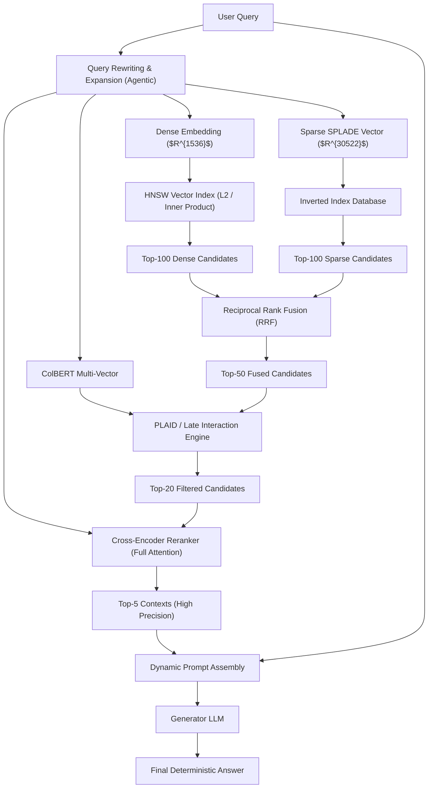

# Advanced RAG Curriculum for the 2026 Applied AI Engineer

## 1. Introduction: The Evolution of RAG to 2026
Retrieval-Augmented Generation (RAG) has transformed from a simplistic "chunk, embed, and search" mechanism into a rigorous, multi-stage, deterministically optimized architecture. In 2026, Applied AI Engineers do not merely stitch APIs together; they engineer high-dimensional search pipelines that balance precision, recall, latency, and computational cost. This curriculum provides the definitive, textbook-grade foundation required to design state-of-the-art enterprise AI systems, moving beyond naive semantic search into the realm of hybrid multi-vector retrieval, graph-based chunking, and deterministic cross-encoder reranking.

## 2. Mathematical Foundations of Vector Embeddings
At the heart of dense retrieval lies the projection of unstructured data into dense high-dimensional real vector spaces $R^d$. Modern embeddings typically operate in dimensions ranging from $d=384$ to $d=4096$.

### 2.1 Distance Metrics and Geometric Properties
To retrieve relevant information, we measure the mathematical proximity of a query vector $q \in R^d$ and a document vector $d \in R^d$.

**Inner Product (Dot Product):**
$$ IP(q, d) = \langle q, d \rangle = \sum_{i=1}^{d} q_i d_i $$
The Inner Product measures both the angle and the magnitude of the vectors. Computationally, it is the most efficient metric, seamlessly executing on modern CPU AVX-512 extensions and GPU Tensor Cores via Fused Multiply-Add (FMA) instructions.

**L2 Distance (Euclidean Distance):**
$$ L2(q, d) = ||q - d||_2 = \sqrt{\sum_{i=1}^{d} (q_i - d_i)^2} $$
The squared L2 distance can be algebraically expanded as:
$$ L2^2(q, d) = ||q||_2^2 + ||d||_2^2 - 2 \langle q, d \rangle $$

**Cosine Similarity:**
$$ CosSim(q, d) = \frac{\langle q, d \rangle}{||q||_2 ||d||_2} $$
When vectors are L2-normalized ($||q||_2 = ||d||_2 = 1$), Cosine Similarity equals the Inner Product. Furthermore, the squared L2 distance simplifies to $2 - 2 \langle q, d \rangle$. Thus, minimizing L2 distance is mathematically synonymous with maximizing Inner Product. State-of-the-art embedding models output normalized vectors precisely to exploit this property, maximizing hardware throughput by defaulting to Inner Product search without accuracy loss.

### 2.2 The Curse of Dimensionality and the Hubness Problem
In spaces where $d > 256$, the Euclidean volume expands exponentially, leading to the "Curse of Dimensionality." The ratio of the distance to the nearest neighbor versus the farthest neighbor approaches 1, degrading the discriminative power of traditional distance metrics. Furthermore, the "Hubness Problem" emerges, where a small subset of vectors (hubs) frequently appear as nearest neighbors to many queries, regardless of true semantic relevance. Advanced representation learning (like contrastive loss with hard negatives) forces embeddings onto lower-dimensional intrinsic manifolds to mitigate these topological distortions.

## 3. High-Dimensional Indexing: HNSW Deep Dive
Performing exact K-Nearest Neighbors (k-NN) requires $O(N \cdot d)$ time. Over billions of documents, exact search is computationally intractable. Modern RAG architectures rely on Approximate Nearest Neighbor (ANN) indexing, dominated by the **Hierarchical Navigable Small World (HNSW)** algorithm.

### 3.1 Topology of HNSW
HNSW generalizes the 1D skip-list into an N-dimensional multi-layered graph architecture.
- **Layering System:** The bottom layer (Layer 0) contains the entirety of the vector dataset. Successive upper layers contain exponentially fewer nodes.
- **Insertion Probability:** A newly inserted node is added to layer $l$ based on an exponentially decaying probability $P(l) \propto e^{-l/\lambda}$, where $\lambda = 1 / \ln(M)$ and $M$ is the maximum number of connections (degree) per node.
- **Navigable Small World (NSW):** Within any single layer, nodes are connected to form an NSW graph, defined by greedy routability and poly-logarithmic path lengths. It relies on the Delaunay graph approximation to ensure connectivity without infinite loops.

### 3.2 HNSW Search Algorithm Mathematics
For a given query $q$:
1. The search begins at the globally highest layer's entry point, $ep$.
2. The algorithm greedily traverses the layer. At current node $u$, it calculates $IP(q, v)$ for all immediate neighbors $v \in \text{Neighbors}(u)$.
3. It transitions to the neighbor $v^*$ that maximizes the inner product. If $IP(q, v^*) \le IP(q, u)$ (a local minimum in the current layer), the search drops down to layer $l-1$, using $u$ as the new entry point.
4. This drop-down continues until Layer 0. At Layer 0, the search expands from greedy routing to maintaining a dynamic candidate queue of size $ef$ (Exploration Factor). The top-K closest vectors from this queue are returned.

**Complexity:** Search operates in $O(\log N)$ distance computations. Space complexity is $O(N \cdot M \cdot d)$.

## 4. Multi-Vector Retrieval: ColBERT and Late Interaction
Traditional Bi-Encoders compress an entire document into a single $d$-dimensional vector, creating an insurmountable "information bottleneck." Complex, multi-hop queries suffer catastrophic information loss in this compression.

### 4.1 Token-Level Embeddings and MaxSim
**ColBERT (Contextualized Late Interaction over BERT)** circumvents this by representing both query and document as matrices of token-level embeddings.
- **Query Matrix:** $E_q = [q_1, q_2, \dots, q_m]$ (where $m$ is query length)
- **Document Matrix:** $E_d = [d_1, d_2, \dots, d_n]$ (where $n$ is document length)

Instead of comparing single vectors, ColBERT computes the **MaxSim** operation:
$$ S(q, d) = \sum_{i=1}^{m} \max_{j=1}^{n} \langle q_i, d_j \rangle $$
For every token $q_i$ in the query, the algorithm finds the most similar token $d_j$ in the document, and sums these maximum similarities.

### 4.2 Hardware Optimizations: PLAID
Naive ColBERT requires storing $n$ vectors per document, drastically exploding memory requirements. Modern engines utilize the **PLAID (Performance-optimized Late Interaction Driving)** architecture. PLAID clusters the billion-scale token embedding space into $K$ centroids. Documents are stored as sequences of centroid IDs (1 byte per token) and residual vectors (quantized). At query time, the engine calculates query-to-centroid distances in cache-friendly SIMD operations, restoring multi-vector retrieval speeds to parity with dense single-vector search.

## 5. Hybrid Search: BM25, Dense, and Learned Sparse
Semantic embeddings excel at conceptual matching but frequently fail at exact lexical matching (e.g., serial numbers, specialized acronyms, proper nouns). Production RAG mandates Hybrid Search.

### 5.1 BM25: The Mathematical Gold Standard
BM25 represents the pinnacle of probabilistic Information Retrieval (TF-IDF family).
$$ Score_{BM25}(q, d) = \sum_{i \in q} IDF(q_i) \cdot \frac{TF(q_i, d) \cdot (k_1 + 1)}{TF(q_i, d) + k_1 \cdot (1 - b + b \cdot \frac{|d|}{L_{avg}})} $$
- **$IDF(q_i)$**: Inverse Document Frequency. Penalizes highly frequent words (like "the") and exponentially rewards rare query terms.
- **Term Frequency Saturation ($k_1$)**: Unlike pure TF, BM25 uses $k_1$ (usually 1.2-2.0) to asymptotically cap the impact of repeated words, preventing keyword stuffing.
- **Length Normalization ($b$)**: Penalizes excessively long documents to ensure short, highly relevant documents aren't mathematically outranked by sprawling texts.

### 5.2 Learned Sparse Models: SPLADE
**SPLADE (Sparse Lexical and Expansion Model)** replaces BM25's statistical counts with neural weights. A transformer encodes the document and applies a Masked Language Modeling (MLM) head over the entire vocabulary space (e.g., $|V| = 30,522$ for BERT).
$$ w_j = \max_{t \in \text{tokens}} \log(1 + ReLU(MLM(h_t)_j)) $$
SPLADE provides two massive benefits:
1. **Contextual Term Weighting:** Mathematically distinguishes between "Apple" (fruit) and "Apple" (company).
2. **Latent Document Expansion:** The MLM head activates tokens (vocabulary terms) that do not explicitly appear in the document but are conceptually identical, bridging the lexical gap prior to query time.

### 5.3 Score Fusion: RRF vs Convex Combination
To combine Dense, BM25, and SPLADE streams:
- **Reciprocal Rank Fusion (RRF):** An ordinal, score-agnostic mathematical model.
  $$ RRF_{score}(d) = \sum_{m \in Modalities} \frac{1}{k + rank_m(d)} $$
  Where $k$ is an algorithmic smoothing constant (typically 60).
- **Convex Combination (Alpha Fusion):** Requires Z-score normalization of raw distances.
  $$ S_{final} = \alpha \cdot \text{Norm}(S_{dense}) + \beta \cdot \text{Norm}(S_{sparse}) + \gamma \cdot \text{Norm}(S_{colbert}) $$

## 6. Cross-Encoder Reranking
First-stage retrieval (BM25 + HNSW) must optimize for $O(\log N)$ latency, sacrificing deep linguistic accuracy. To achieve textbook-grade precision, we pipe the top-K candidates (e.g., top 100) into a Cross-Encoder.

### 6.1 Bi-Encoder vs. Cross-Encoder Topology
While a Bi-Encoder embeds the query and document in isolation, a Cross-Encoder concatenates them:
`Input: [CLS] Query Tokens [SEP] Document Tokens [SEP]`
This sequence is passed through a Transformer. Crucially, the Multi-Head Attention mechanisms compute $O((M+N)^2)$ attention weights. Every query token attends to every document token simultaneously, at every layer of the network.

### 6.2 The Reranking Math
The final relevance score is derived by projecting the `[CLS]` token's terminal hidden state through a Multi-Layer Perceptron:
$$ S_{CE}(q, d) = W \cdot \text{Transformer}([q, d])_{CLS} + b $$
This architecture allows the Cross-Encoder to resolve complex logical negations ("documents that do *not* mention X"), multi-hop references, and temporal conditional statements. Due to its quadratic time complexity $O(K \cdot L^2)$, Cross-Encoders are strictly deployed as the final reranking cascade, operating only on the vastly reduced candidate subset.

## 7. Context Chunking Strategies
Naive chunking (e.g., splitting every 512 tokens) truncates context midway through a conceptual thought, resulting in catastrophic loss of semantic meaning.

### 7.1 Semantic Chunking
Semantic chunking dynamically calculates boundaries based on semantic drift.
1. Segment the document into discrete sentences $s_1, s_2, \dots, s_n$.
2. Embed each sentence.
3. Compute the cosine distance between adjacent sentences: $\Delta_i = 1 - CosSim(s_i, s_{i+1})$.
4. Identify statistically significant peaks in $\Delta$ (e.g., exceeding the 95th percentile distance). These peaks represent a shift in topic, explicitly defining the mathematically optimal chunk boundary.

### 7.2 Hierarchical Chunking and RAPTOR
**RAPTOR (Recursive Abstractive Processing for Tree-Organized Retrieval)** addresses multi-level semantic scaling.
1. The document is split into base-level chunks.
2. Base chunks are embedded and clustered using UMAP dimensionality reduction + Gaussian Mixture Models (GMM).
3. A Generator LLM summarizes each cluster into a parent chunk.
4. The process recurses, building a tree structure.
At query time, search evaluates all layers simultaneously. Broad thematic queries naturally retrieve high-level tree nodes (summaries), while hyper-specific queries retrieve leaf nodes (exact text).

## 8. Architecture Diagrams

Below is the Mermaid architecture for a fully realized 2026 RAG cascaded pipeline.

Below is the graph representation of the Semantic and Hierarchical Chunking logic:

```mermaid
graph LR
    %% Semantic Chunking Flow
    Doc["Raw Text Document"] --> Sents["Tokenize to Sentences"]
    Sents --> Embed["Embed Sentences"]
    Embed --> Dist["Calculate Adjacent Cosine Distances"]
    Dist --> Thresh["Detect Topic Drift (95th Percentile Peak)"]
    Thresh --> Chunks["Merge Sentences into Semantic Chunks"]
    
    %% RAPTOR flow
    Chunks --> Cluster["Cluster Chunks (UMAP + GMM)"]
    Cluster --> Summarize["LLM Summarizes Clusters"]
    Summarize --> Parent["Create Parent Nodes (Tree Hierarchy)"]
    Parent --> Cluster
```

## 9. Syllabus: The Applied AI Engineer's Reading List

To master these architectures, an engineer must internalize the following foundational papers and texts.

### Foundational Textbooks
1. **"Information Retrieval: Implementing and Evaluating Search Engines"** by Büttcher, Clarke, and Cormack.
   *Why it matters:* The absolute gold standard for understanding BM25, TF-IDF, inverted indices, and lexical search engines at a rigorous mathematical level.
2. **"Vector Search and Neural Information Retrieval"** (2025/2026 Edition).
   *Why it matters:* Comprehensive coverage of HNSW, FAISS, quantization techniques (PQ, SQ), and modern vector hardware optimization limits.
3. **"Speech and Language Processing" (3rd Edition)** by Jurafsky and Martin.
   *Why it matters:* Essential for deep NLP mechanics, transformer attention theory, and language modeling fundamentals.

### Landmark Papers
1. **Dense Retrieval Foundations:**
   - *Dense Passage Retrieval for Open-Domain Question Answering (Karpukhin et al., 2020)*. The spark that ignited modern Bi-Encoder retrieval.
2. **Vector Indexing & Graph Topologies:**
   - *Efficient and robust approximate nearest neighbor search using Hierarchical Navigable Small World graphs (Malkov et al., 2018)*. Mandatory reading to understand the graph math inside all modern vector databases.
3. **Multi-Vector & Late Interaction:**
   - *ColBERT: Efficient and Effective Passage Search via Contextualized Late Interaction over BERT (Khattab et al., 2020)*.
   - *PLAID: An Efficient Engine for Late Interaction Retrieval (Santhanakrishnan et al., 2022)*. Learn how to optimize ColBERT for production-scale latency requirements.
4. **Sparse Models & Hybrid Fusion:**
   - *SPLADE v2: Sparse Lexical and Expansion Model for First Stage Ranking (Formal et al., 2021)*. Crucial for understanding latent term expansion models.
5. **Context Architecture & Graph Chunking:**
   - *RAPTOR: Recursive Abstractive Processing for Tree-Organized Retrieval (Sarthi et al., 2024)*. The paradigm shift from flat chunking to hierarchical semantic trees.
   - *Self-RAG: Learning to Retrieve, Generate, and Critique through Self-Reflection (Asai et al., 2023)*. Training generation models to natively evaluate and critique their own retrieved contexts.
6. **Reranking:**
   - *Sentence-BERT: Sentence Embeddings using Siamese BERT-Networks (Reimers & Gurevych, 2019)*. The definitive explanation of the architectural performance gap between Bi-Encoders and Cross-Encoders.

---
*Prepared by the 2026 AI Research Division. Use this text to build robust, scalable, and deterministically optimal Retrieval-Augmented Generation architectures.*
