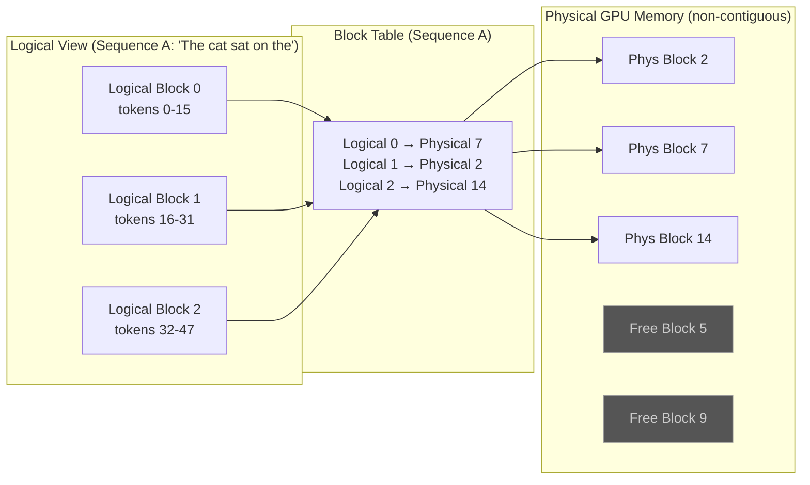
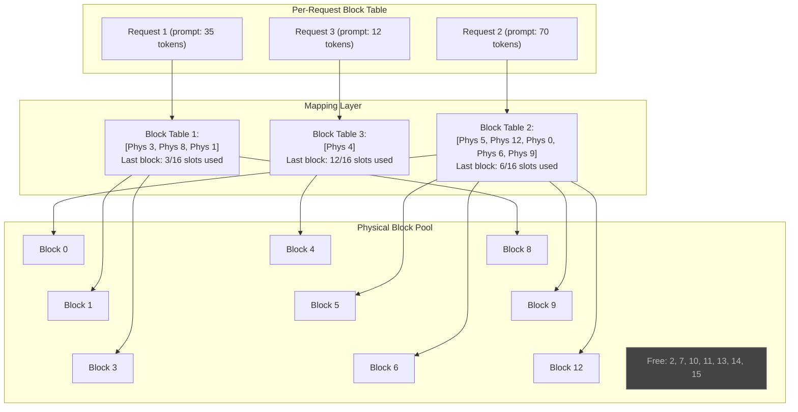
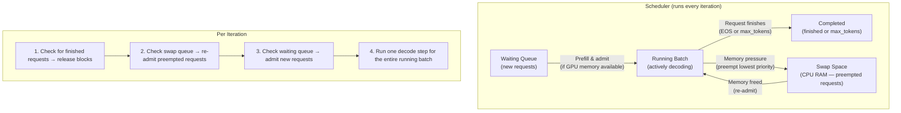

# AI Inference Systems: From Theory to Production (2026 Curriculum)

> **Target reader:** Staff-level distributed-systems engineer transitioning into AI Infrastructure.
> **Prerequisites:** Familiarity with GPU architecture basics (SMs, HBM, PCIe/NVLink), operating-system virtual memory, and linear algebra fundamentals.
> **Estimated study time:** 60–80 hours across 6–8 weeks.

---

## Why This Module Matters

Training a large language model is a one-time capital expenditure; *serving* it is a recurring operational expense that dominates total cost of ownership. At scale, inference accounts for **80–90 %** of all GPU-hours consumed by an LLM-powered product. As a distributed-systems engineer, you already understand scheduling, memory management, and parallelism — the core abstractions of modern inference engines are direct analogues of concepts you know from OS and database kernel design. This module maps those familiar mental models onto the transformer serving stack.

---

## 1. The Autoregressive Inference Loop

### 1.1 How Text Generation Works

A decoder-only transformer (GPT, LLaMA, Mistral, etc.) generates text **one token at a time**, each token conditioned on the entire sequence produced so far. This creates two distinct computational phases:

| Phase | Input | Output | Dominant Bottleneck |
|-------|-------|--------|---------------------|
| **Prefill** (prompt processing) | Full prompt of length $P$ | KV cache + first token | Compute-bound (large matrix multiplications) |
| **Decode** (autoregressive generation) | Single new token per step | Next token + updated KV cache | Memory-bandwidth-bound |

### 1.2 The Attention Math

For a single attention head, given input hidden states $\mathbf{X} \in \mathbb{R}^{s \times d}$ (sequence length $s$, hidden dimension $d$), we compute:

$$
\mathbf{Q} = \mathbf{X}\mathbf{W}_Q, \quad
\mathbf{K} = \mathbf{X}\mathbf{W}_K, \quad
\mathbf{V} = \mathbf{X}\mathbf{W}_V
$$

$$
\text{Attention}(\mathbf{Q}, \mathbf{K}, \mathbf{V}) = \text{softmax}\!\left(\frac{\mathbf{Q}\mathbf{K}^T}{\sqrt{d_k}}\right)\mathbf{V}
$$

where $d_k$ is the per-head dimension.

**During prefill**, $\mathbf{Q}$, $\mathbf{K}$, and $\mathbf{V}$ all have $s = P$ rows — these are large GEMMs (General Matrix Multiplications), and the GPU's tensor cores are fully utilized. The arithmetic intensity (FLOPs per byte loaded from memory) is high.

**During decode**, only a *single* new query vector $\mathbf{q} \in \mathbb{R}^{1 \times d_k}$ is computed per step. We must load the *entire* KV cache ($\mathbf{K}, \mathbf{V}$ for all previous tokens) from HBM to compute $\mathbf{q}\mathbf{K}^T$. This is a **matrix-vector product** — the arithmetic intensity drops dramatically:

$$
\text{Arithmetic Intensity}_{\text{decode}} = \frac{2 \cdot s_{\text{ctx}}}{2 \cdot s_{\text{ctx}} \cdot d_k \cdot \text{sizeof(dtype)}} = \frac{1}{d_k \cdot \text{sizeof(dtype)}}
$$

For FP16 with $d_k = 128$: arithmetic intensity ≈ $\frac{1}{256}$ FLOPs/byte — well below the compute-to-bandwidth ratio of any modern GPU. **Decode is memory-bandwidth-bound, not compute-bound.** This single insight drives nearly every optimization in modern inference engines.

### 1.3 Latency Metrics

| Metric | Definition | What it Measures | User Perception |
|--------|-----------|------------------|-----------------|
| **TTFT** (Time To First Token) | Wall-clock time from request arrival to the first generated token | Prefill speed + scheduling delay | "How long before I see *something*?" |
| **ITL** (Inter-Token Latency) | Average time between successive generated tokens | Decode throughput per request | "How smooth is the streaming?" |
| **TPOT** (Time Per Output Token) | Similar to ITL, sometimes used interchangeably | Per-token decode cost | — |
| **E2E Latency** | TTFT + (num_output_tokens × ITL) | Total request time | "When does my answer arrive?" |
| **Throughput** | Total tokens generated per second across all requests | System-level efficiency | Cost per token |

> [!TIP]
> **Systems intuition:** TTFT is analogous to *request setup latency* (TCP handshake, connection establishment), while ITL is *per-packet throughput*. Optimizing one often trades off against the other — larger batches improve throughput but increase TTFT.

---

## 2. KV Cache: Memory Management for Transformers

### 2.1 What is the KV Cache?

During autoregressive decode, we avoid recomputing all previous Keys and Values by caching them. For every decode step, we append one new $(k, v)$ pair per layer per head and reuse all prior pairs.

### 2.2 Memory Formula

For a model with $L$ layers, $H_{kv}$ KV-heads (with GQA, $H_{kv} \leq H_q$), per-head dimension $d_h$, sequence length $s$, and datatype of $b$ bytes:

$$
\boxed{
\text{KV Cache Memory} = 2 \times L \times H_{kv} \times d_h \times s \times b
}
$$

**Worked example — LLaMA-3 70B (FP16):**

| Parameter | Value |
|-----------|-------|
| $L$ (layers) | 80 |
| $H_{kv}$ (GQA KV-heads) | 8 |
| $d_h$ (head dim) | 128 |
| $s$ (context length) | 8192 |
| $b$ (FP16 bytes) | 2 |

$$
\text{KV Cache} = 2 \times 80 \times 8 \times 128 \times 8192 \times 2 = 2{,}684{,}354{,}560 \;\text{bytes} \approx 2.5\;\text{GB per sequence}
$$

An A100 (80 GB) holding the 70B model weights (≈ 140 GB FP16, tensor-parallelized across 2 GPUs → 70 GB/GPU) has roughly **10 GB free per GPU** → supporting only **~4 concurrent sequences** with naive allocation. This severely limits throughput.

### 2.3 The Waste Problem

Naive implementations **pre-allocate** the maximum possible context length for every request (e.g., 8192 or 128k tokens), even when the actual sequence is much shorter. Empirical measurements show:

- Average actual sequence length: **20–40%** of max context window
- **60–80% of allocated KV cache memory is wasted**
- Internal fragmentation (within a request) and external fragmentation (between requests) compound

This is precisely the same problem that motivated **virtual memory** in operating systems.

### 2.4 The OS Analogy

| OS Concept | Inference Analogue |
|-----------|-------------------|
| Virtual address space | Logical KV cache (contiguous per-sequence view) |
| Physical page frames | Physical GPU memory blocks |
| Page table | Block table |
| Demand paging | Allocate blocks only as tokens are generated |
| Swapping | Offload KV blocks to CPU RAM under memory pressure |
| Copy-on-Write (CoW) | Share KV blocks across beam search branches |

This analogy is not metaphorical — PagedAttention implements *exactly* these mechanisms.

---

## 3. PagedAttention (vLLM)

> **Reference:** Kwon, W., Li, Z., Zhuang, S., et al. "Efficient Memory Management for Large Language Model Serving with PagedAttention." *SOSP 2023.*

### 3.1 Core Idea

PagedAttention divides the KV cache into fixed-size **blocks** (analogous to OS memory pages). Each block stores the K and V vectors for a fixed number of tokens (e.g., 16). A **block table** per sequence maps logical block indices to physical block locations in GPU memory.



### 3.2 Block Table Architecture in Detail



**Key properties:**
- **No internal fragmentation** except the last block of each sequence (< 1 block wasted per request).
- **No external fragmentation** — any free block can serve any request.
- Memory waste drops from 60–80% to **< 4%** in practice.

### 3.3 Copy-on-Write for Parallel Sampling

In beam search or parallel sampling, multiple candidate sequences share a common prefix. PagedAttention implements **Copy-on-Write (CoW)**: shared prefix blocks have a reference count > 1 and are only copied when one branch needs to modify them.

$$
\text{Memory with CoW} = \text{shared prefix blocks} + \sum_{i=1}^{n_{\text{beams}}} \text{divergent blocks}_i
$$

Without CoW, memory scales as $O(n_{\text{beams}} \times s)$; with CoW, shared prefixes cost $O(s)$ regardless of beam count.

### 3.4 Measured Impact

The vLLM paper reports **2–4× throughput improvement** over HuggingFace Transformers and **up to 24× improvement** in parallel sampling scenarios, with no change in output quality.

---

## 4. Continuous Batching (Iteration-Level Scheduling)

### 4.1 The Problem with Static Batching

In **static batching**, a batch of requests is assembled, and the entire batch runs until *all* requests finish. If one request generates 10 tokens and another generates 500, the short request's GPU slot sits idle for 490 steps. GPU utilization: often **< 30%**.

### 4.2 Continuous Batching Algorithm

**Continuous (iteration-level) batching** allows the scheduler to insert and retire requests at *every decode step*:



### 4.3 Scheduler Policies

| Policy | Mechanism | Best For |
|--------|-----------|----------|
| **FCFS** (First Come First Served) | Simple queue ordering | Fairness-sensitive workloads |
| **Priority-based** | Weighted priority scores | SLA-differentiated traffic |
| **Preemptive (recompute)** | Discard KV cache; recompute on re-admit | Memory-constrained systems |
| **Preemptive (swap)** | Offload KV cache to CPU; reload on re-admit | Large CPU-memory systems |

### 4.4 Throughput Impact

Under realistic workloads (request lengths drawn from ShareGPT traces), continuous batching achieves:

| Metric | Static Batching | Continuous Batching | Improvement |
|--------|----------------|--------------------:|:-----------:|
| GPU utilization | ~25–35% | ~85–95% | **~3×** |
| Throughput (tokens/sec) | baseline | 2–3× baseline | **2–3×** |
| p99 latency | high variance | tighter distribution | improved |

> [!IMPORTANT]
> Continuous batching is now the **standard** in every production inference engine. If you encounter a system still using static batching, it is leaving 2–3× throughput on the table.

---

## 5. Quantization for Inference

### 5.1 The Precision Ladder

| Format | Bits | Bytes | Memory Savings vs FP32 | Typical Quality Loss |
|--------|------|-------|----------------------:|---------------------:|
| FP32 | 32 | 4 | 1× (baseline) | — |
| FP16 / BF16 | 16 | 2 | 2× | Negligible |
| FP8 (E4M3/E5M2) | 8 | 1 | 4× | < 1% on most tasks |
| INT8 | 8 | 1 | 4× | 1–3% |
| INT4 | 4 | 0.5 | 8× | 2–5% |
| NF4 (QLoRA) | 4 | 0.5 | 8× | ~1–2% |

### 5.2 PTQ vs QAT

**Post-Training Quantization (PTQ):** Apply quantization *after* training using a small calibration dataset. No retraining required. Fast, cheap, and usually "good enough."

**Quantization-Aware Training (QAT):** Simulate quantization during training (forward pass uses quantized weights; backward pass uses straight-through estimators). Higher quality but requires access to training infrastructure.

### 5.3 Key Algorithms

**GPTQ** (Frantar et al., 2022): Layer-by-layer weight quantization. Solves a per-layer reconstruction problem:

$$
\min_{\hat{\mathbf{W}}} \|\mathbf{W}\mathbf{X} - \hat{\mathbf{W}}\mathbf{X}\|_2^2
$$

using an iterative OBS (Optimal Brain Surgeon) approach with Hessian information $\mathbf{H} = 2\mathbf{X}\mathbf{X}^T$. Quantizes a 70B model in ~4 hours on a single GPU.

**AWQ** (Lin et al., 2023): Activation-Aware Weight Quantization. Key insight: **1% of weights are disproportionately important** (corresponding to salient activation channels). AWQ applies per-channel scaling before quantization:

$$
\hat{\mathbf{W}} = \text{Quant}(\mathbf{W} \cdot \text{diag}(\mathbf{s})) , \quad \hat{\mathbf{X}} = \mathbf{X} \cdot \text{diag}(\mathbf{s})^{-1}
$$

The scale factors $\mathbf{s}$ are searched to minimize quantization error on salient channels.

**SmoothQuant** (Xiao et al., 2023): Addresses the challenge that *activations* (not just weights) have large outlier channels. Migrates quantization difficulty from activations to weights via a mathematically equivalent smoothing transform:

$$
\mathbf{Y} = (\mathbf{X}\text{diag}(\mathbf{s})^{-1}) \cdot (\text{diag}(\mathbf{s})\mathbf{W}) = \hat{\mathbf{X}} \hat{\mathbf{W}}
$$

where $\mathbf{s}_j = \max(|\mathbf{X}_j|)^\alpha / \max(|\mathbf{W}_j|)^{1-\alpha}$ and $\alpha \in [0,1]$ controls the migration strength.

### 5.4 Decision Framework

> [!TIP]
> **Rule of thumb for 2026:** Start with **FP8** if your hardware supports it (H100, B200, MI300X). Fall back to **INT8 with AWQ/SmoothQuant** for broader compatibility. Use **INT4** only when memory constraints are binding and you have validated quality on your specific evaluation suite.

---

## 6. Speculative Decoding

### 6.1 Core Idea

Autoregressive decode is sequential — but what if we could *speculate* ahead? Speculative decoding uses a **small, fast draft model** $M_q$ to propose $\gamma$ candidate tokens, then verifies all $\gamma$ tokens in a single forward pass of the **large target model** $M_p$.

**The key mathematical guarantee:** through a modified rejection sampling scheme, the output distribution is *provably identical* to sampling from $M_p$ alone. There is zero quality loss.

### 6.2 The Algorithm

1. **Draft:** Run $M_q$ for $\gamma$ steps, producing tokens $x_1, \ldots, x_\gamma$ with probabilities $q(x_t \mid x_{<t})$.
2. **Verify:** Run $M_p$ on the full speculated sequence in *one* forward pass (parallel attention over all $\gamma$ positions). Obtain $p(x_t \mid x_{<t})$.
3. **Accept/Reject:** For each position $t = 1, \ldots, \gamma$:
   - Accept $x_t$ with probability $\min\!\left(1, \frac{p(x_t)}{q(x_t)}\right)$
   - If rejected, resample from an adjusted distribution $\text{norm}(\max(0, p(x) - q(x)))$ and stop.
4. If all $\gamma$ tokens accepted, sample one *bonus* token from $M_p$ at position $\gamma + 1$.

### 6.3 Speedup Analysis

Let $\alpha$ be the **acceptance rate** (probability of the draft model's token being accepted). The expected number of tokens generated per verification step is:

$$
\boxed{
E[\text{tokens per step}] = \frac{1 - \alpha^{\gamma+1}}{1 - \alpha}
}
$$

The speedup depends on:
- $\alpha$: higher when $M_q$ closely approximates $M_p$ (e.g., same model family, distilled).
- $c = \frac{\text{latency}(M_q, \gamma\text{ steps})}{\text{latency}(M_p, 1\text{ step})}$: the relative cost of drafting.

$$
\text{Speedup} \approx \frac{E[\text{tokens per step}]}{1 + c}
$$

### 6.4 When It Helps vs Hurts

| Scenario | Acceptance Rate | Speedup | Verdict |
|----------|:--------------:|:-------:|:-------:|
| Code completion (predictable syntax) | 0.85–0.95 | 2–3× | ✅ Large win |
| Conversational chat | 0.70–0.85 | 1.5–2× | ✅ Moderate win |
| Creative writing (high entropy) | 0.40–0.60 | 1.0–1.3× | ⚠️ Marginal |
| Large batch, GPU already saturated | any | < 1× | ❌ Hurts (draft overhead wasted) |

> [!NOTE]
> Speculative decoding is most beneficial when the GPU is **underutilized** (small batch, decode-bound). In high-throughput batch serving where the GPU is already compute-saturated, the draft model's FLOPs compete for limited compute, and the technique can *hurt* throughput.

---

## 7. Parallelism Strategies for Large Model Serving

### 7.1 Tensor Parallelism (TP)

Splits individual weight matrices **within a layer** across GPUs. For multi-head attention, each GPU holds a subset of attention heads. For FFN layers, the weight matrix is column-split (or row-split) across devices.

**Communication:** Requires an **all-reduce** after each layer's computation (on the order of microseconds over NVLink). Best suited for intra-node parallelism.

**Latency:** Lowest per-token latency for single requests because all GPUs work on every token simultaneously.

$$
\text{Per-GPU memory} \approx \frac{\text{Model size}}{\text{TP degree}}
$$

### 7.2 Pipeline Parallelism (PP)

Assigns different **layers** to different GPUs. GPU 0 processes layers 0–19, GPU 1 processes layers 20–39, etc.

**Communication:** Point-to-point sends of activation tensors between stages. Can use inter-node interconnects (lower bandwidth is tolerable because communication happens once per microbatch per stage boundary).

**Drawback:** **Pipeline bubbles** — GPUs are idle while waiting for their stage's input. Mitigated by micro-batching but never fully eliminated.

### 7.3 Data Parallelism (DP)

Replicates the **entire model** (or a TP group) across GPU groups. Each replica serves a different subset of requests.

**Communication:** None during inference (unlike training, no gradient sync needed).

**Use case:** Scaling throughput horizontally when the model fits within a single node (or TP group).

### 7.4 Decision Framework

```
Model fits on 1 GPU?
├── Yes → Use DP to scale throughput
└── No → Model fits on 1 node (with TP)?
    ├── Yes → Use TP within the node, DP across nodes
    └── No → Use TP within node + PP across nodes
         └── Then DP across multi-node replicas for throughput
```

| Strategy | Communication | Best Interconnect | Latency Impact | Throughput Impact |
|----------|:------------:|:-----------------:|:-------------:|:-----------------:|
| TP | All-reduce per layer | NVLink (intra-node) | Lowest latency | — |
| PP | Point-to-point per stage | PCIe / InfiniBand OK | Adds pipeline bubble | — |
| DP | None at inference | Any | No impact | Linear throughput scaling |

> [!IMPORTANT]
> **Rule of thumb for 2026:** Prefer **TP-only within a node** for latency-sensitive serving. Add PP only when the model is too large for a single node's aggregate GPU memory. Use DP replicas for throughput scaling.

---

## 8. The 2026 Inference Engine Landscape

### 8.1 vLLM

The engine that introduced PagedAttention to production. Broadly adopted, hardware-agnostic (NVIDIA, AMD, Intel, TPU).

**Key features:**
- PagedAttention with block-level memory management
- Continuous batching with preemptive scheduling
- Prefix caching (automatic KV cache reuse for shared prefixes)
- Broad model support (LLaMA, Mistral, Mixtral, Qwen, DeepSeek, etc.)
- OpenAI-compatible API server

### 8.2 SGLang

Developed at UC Berkeley, focused on **structured generation** and agentic workloads with heavy prefix sharing.

**Key features:**
- **RadixAttention:** Maintains a radix tree of KV cache segments for efficient prefix matching and reuse. Especially powerful for agentic workloads where many requests share system prompts and tool definitions.
- Compressed finite-state machines for constrained decoding (JSON, regex).
- Data parallelism with expert parallelism support.
- Highly competitive throughput benchmarks as of 2025–2026.

### 8.3 TensorRT-LLM

NVIDIA's compiled inference engine. Leverages TensorRT's graph optimization and kernel fusion for maximum NVIDIA hardware utilization.

**Key features:**
- Aggressive kernel fusion and flash attention kernels
- FP8 support on Hopper/Blackwell
- In-flight batching (NVIDIA's term for continuous batching)
- Tight integration with Triton Inference Server for orchestration

### 8.4 Comparison Table

| Feature | vLLM | SGLang | TensorRT-LLM |
|---------|:----:|:------:|:-------------:|
| **PagedAttention** | ✅ (original) | ✅ (RadixAttention) | ✅ |
| **Continuous batching** | ✅ | ✅ | ✅ (in-flight batching) |
| **Prefix caching** | ✅ (automatic) | ✅ (RadixAttention — best-in-class) | ✅ |
| **Speculative decoding** | ✅ | ✅ | ✅ |
| **FP8 quantization** | ✅ | ✅ | ✅ (best kernel support) |
| **Multi-hardware** | NVIDIA, AMD, Intel, TPU | NVIDIA, AMD | NVIDIA only |
| **Structured output** | Basic (outlines) | Best-in-class (FSM) | Limited |
| **Ease of deployment** | Simple (pip install) | Simple (pip install) | Complex (build system) |
| **Kernel performance (NVIDIA)** | Good | Good–Excellent | Excellent (compiled) |
| **Agentic/prefix-heavy workloads** | Good | Excellent | Good |
| **Community & ecosystem** | Largest | Growing fast | NVIDIA ecosystem |
| **Best for** | General-purpose serving | Agentic, structured output | Max perf on NVIDIA HW |

> [!TIP]
> **Practical advice:** Start with **vLLM** for its simplicity and broad ecosystem. Evaluate **SGLang** if your workload is agentic (heavy prefix sharing, structured output). Consider **TensorRT-LLM** if you are NVIDIA-only and need the absolute last 10–15% of performance.

---

## 9. Master Syllabus & Reading List

### 9.1 Essential Papers

| # | Paper | Venue | Key Contribution |
|---|-------|-------|------------------|
| 1 | **"Attention Is All You Need"** — Vaswani et al. | NeurIPS 2017 | The transformer architecture |
| 2 | **"FlashAttention: Fast and Memory-Efficient Exact Attention"** — Dao et al. | NeurIPS 2022 | IO-aware exact attention; tiling for SRAM |
| 3 | **"FlashAttention-2: Faster Attention with Better Parallelism and Work Partitioning"** — Dao | ICLR 2024 | Improved GPU occupancy, sequence parallelism |
| 4 | **"Efficient Memory Management for Large Language Model Serving with PagedAttention"** — Kwon et al. | SOSP 2023 | PagedAttention, vLLM |
| 5 | **"Fast Inference from Transformers via Speculative Decoding"** — Leviathan et al. | ICML 2023 | Speculative decoding with provable guarantees |
| 6 | **"GPTQ: Accurate Post-Training Quantization for Generative Pre-trained Transformers"** — Frantar et al. | ICLR 2023 | OBS-based weight quantization |
| 7 | **"AWQ: Activation-aware Weight Quantization"** — Lin et al. | MLSys 2024 | Salient-channel-aware INT4 quantization |
| 8 | **"SmoothQuant: Accurate and Efficient Post-Training Quantization for LLMs"** — Xiao et al. | ICML 2023 | Activation smoothing for INT8 quantization |
| 9 | **"Orca: A Distributed Serving System for Transformer-Based LLMs"** — Yu et al. | OSDI 2022 | Continuous (iteration-level) batching |
| 10 | **"SGLang: Efficient Execution of Structured Language Model Programs"** — Zheng et al. | 2024 | RadixAttention, structured generation |
| 11 | **"Efficiently Scaling Transformer Inference"** — Pope et al. | MLSys 2023 | Parallelism strategy analysis for inference |
| 12 | **"DeepSeek-V3 Technical Report"** — DeepSeek AI | 2024 | Multi-head latent attention, MoE inference at scale |

### 9.2 Codebases to Study

| Codebase | What to Study | Start Here |
|----------|--------------|------------|
| [vLLM](https://github.com/vllm-project/vllm) | Block manager, scheduler, PagedAttention kernels | `vllm/core/block_manager.py`, `vllm/core/scheduler.py` |
| [SGLang](https://github.com/sgl-project/sglang) | Radix cache, constrained decoding FSM | `python/sglang/srt/managers/schedule_batch.py` |
| [FlashAttention](https://github.com/Dao-AILab/flash-attention) | Tiled attention CUDA kernels | `csrc/flash_attn/` |
| [llama.cpp](https://github.com/ggerganov/llama.cpp) | CPU/edge inference, GGUF quantization | `ggml.c`, `llama.cpp` |

### 9.3 Books and Long-Form References

| Title | Authors | Relevant Chapters |
|-------|---------|-------------------|
| *Efficient Deep Learning* | Menghani (2024) | Ch. 6–8: Quantization, Pruning, Efficient Inference |
| *Programming Massively Parallel Processors* | Kirk & Hwu (4th ed.) | Ch. 4–7: GPU memory hierarchy, tiling, occupancy |
| *Designing Data-Intensive Applications* | Kleppmann | Ch. 1, 6, 11: Systems thinking, partitioning, streaming (mental models) |

### 9.4 Hands-On Lab Progression

| Week | Lab | Goal |
|------|-----|------|
| 1 | Implement single-head attention from scratch (PyTorch) | Internalize Q, K, V math |
| 2 | Profile prefill vs decode with `torch.profiler` | See compute vs memory bandwidth bound |
| 3 | Deploy a 7B model with vLLM; benchmark TTFT and ITL | Understand serving metrics |
| 4 | Enable prefix caching; measure throughput on shared-prefix workloads | PagedAttention in practice |
| 5 | Quantize a model (AWQ INT4 → FP8) and compare quality/throughput | Quantization tradeoffs |
| 6 | Enable speculative decoding in vLLM; measure speedup across tasks | Speculative decoding ROI |
| 7 | Deploy a 70B model with TP=4 across a multi-GPU node | Tensor parallelism hands-on |
| 8 | Load-test with varying request rates; tune scheduler parameters | Production tuning |

---

## Glossary of Key Terms

| Term | Definition |
|------|-----------|
| **Arithmetic Intensity** | Ratio of FLOPs to bytes transferred; determines whether a kernel is compute-bound or memory-bound |
| **Block Table** | Per-sequence mapping from logical KV block indices to physical GPU memory locations |
| **Continuous Batching** | Scheduler strategy that inserts/retires requests at every decode iteration |
| **GQA (Grouped Query Attention)** | Attention variant where multiple query heads share a single KV head, reducing KV cache size |
| **HBM (High Bandwidth Memory)** | GPU main memory (e.g., 80 GB on A100, 192 GB on B200); bandwidth is the bottleneck during decode |
| **ITL (Inter-Token Latency)** | Time between successive generated tokens |
| **KV Cache** | Stored Key and Value tensors from previous decode steps, reused to avoid recomputation |
| **PagedAttention** | Memory management technique that stores KV cache in non-contiguous blocks, inspired by OS virtual memory |
| **Prefill** | Phase where the model processes the entire input prompt in parallel |
| **TTFT (Time To First Token)** | Latency from request submission to the first generated token |

---

## Summary: The Systems Engineer's Mental Model

```
┌──────────────────────────────────────────────────────────────────────┐
│                    INFERENCE REQUEST LIFECYCLE                       │
│                                                                      │
│  Request arrives                                                     │
│       │                                                              │
│       ▼                                                              │
│  ┌─────────┐    ┌──────────┐    ┌──────────┐    ┌───────────────┐  │
│  │ Waiting  │───▶│ Prefill  │───▶│  Decode  │───▶│   Complete    │  │
│  │  Queue   │    │ (compute │    │ (memory  │    │ (release KV   │  │
│  │          │    │  bound)  │    │ BW bound)│    │  blocks)      │  │
│  └─────────┘    └──────────┘    └──────────┘    └───────────────┘  │
│       ▲              │               │                               │
│       │              ▼               ▼                               │
│       │         KV cache        KV cache grows                       │
│       │         allocated       block by block                       │
│       │         (PagedAttention) (PagedAttention)                    │
│       │                              │                               │
│       │                    Memory pressure?                          │
│       │                    ├── Yes: preempt → swap to CPU            │
│       │                    └── No: continue decoding                 │
│       │                                                              │
│       └──── New slot available → admit next from waiting queue       │
│                    (Continuous Batching)                              │
└──────────────────────────────────────────────────────────────────────┘
```

The entire inference stack is an exercise in **managing the tension between latency and throughput** under the constraint of **finite GPU memory and memory bandwidth.** Every technique in this module — PagedAttention, continuous batching, quantization, speculative decoding, parallelism — attacks one facet of this fundamental tension. As a distributed-systems engineer, you have spent your career managing analogous tensions (tail latency vs throughput, memory vs disk, consistency vs availability). The vocabulary changes; the engineering principles do not.

---

*Last updated: 2026-05-24 — Part of the [AI Infrastructure Transition Playbook](/Users/lingquan/Projects/ai-transition-playbook).*
