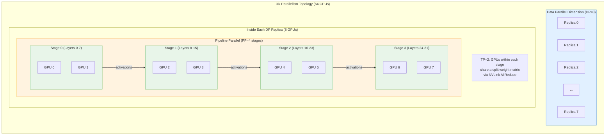
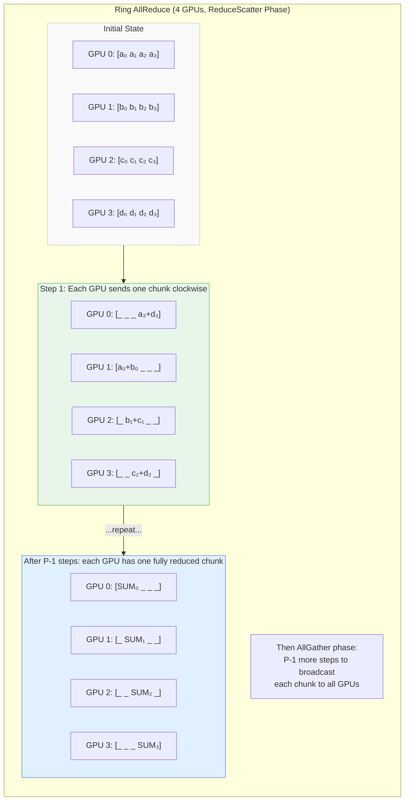

# GPU Systems & Distributed Training (2026 Curriculum)

> **Target reader:** Staff-level distributed systems engineer transitioning to AI Infrastructure.
> **Prerequisites:** Comfort with systems programming (C/C++/Rust), familiarity with networking (TCP, RDMA concepts), and basic linear algebra.

---

## 1. GPU Architecture for AI Engineers

Before you can reason about training a 400-billion-parameter model across 1,024 GPUs, you need a precise mental model of what happens inside *one* GPU.

### 1.1 CUDA Cores vs Tensor Cores

A modern NVIDIA GPU (e.g., H100 SXM) contains two fundamentally different compute units:

| Unit | Purpose | Precision | Peak FLOPS (H100) |
|---|---|---|---|
| **CUDA Cores** | General-purpose scalar/vector FP & INT ops | FP32, FP64, INT32 | ~67 TFLOPS (FP32) |
| **Tensor Cores** | Dense matrix-multiply-accumulate (MMA) | FP16, BF16, FP8, INT8 | ~990 TFLOPS (FP16) |

Tensor Cores execute a *warp-level* matrix operation of the form:

$$D = A \times B + C$$

where $A$, $B$, $C$, and $D$ are small tiles (e.g., 16×16 for FP16). The entire multiply-accumulate is performed in a single instruction cycle across 32 threads (one warp). This is why Transformer training—dominated by `nn.Linear` and attention score computation—spends >90% of its FLOPS on Tensor Cores.

**Key insight for the systems engineer:** Tensor Cores are *throughput engines*. Your job in AI Infra is to keep them fed with data. Every microsecond a Tensor Core stalls waiting for memory is wasted silicon.

### 1.2 GPU Memory Hierarchy

```
Registers        (per-thread)     ~256 KB per SM    │ fastest
  ↓                                                 │
Shared Memory    (per-block)      228 KB per SM     │
  ↓                                                 │
L2 Cache         (chip-wide)      50 MB             │
  ↓                                                 │
HBM3e            (off-chip)       80 GB @ 3.35 TB/s │ slowest
```

The defining constraint of LLM inference is **memory bandwidth**. During autoregressive decoding, each generated token requires reading the *entire* model weight matrix from HBM exactly once (assuming no KV-cache misses). For a 70B-parameter model in FP16:

$$\text{Bytes per token} = 70 \times 10^9 \times 2\;\text{bytes} = 140\;\text{GB}$$

On an H100 with 3.35 TB/s bandwidth:

$$\text{Min latency per token} = \frac{140\;\text{GB}}{3{,}350\;\text{GB/s}} \approx 41.8\;\text{ms}$$

This is a hard floor—no amount of compute optimization can beat it. This is why techniques like quantization (reducing bytes per parameter) and speculative decoding (amortizing reads across multiple candidate tokens) are so critical.

### 1.3 Arithmetic Intensity and the Roofline Model

Arithmetic intensity is the ratio of compute to memory traffic:

$$I = \frac{\text{FLOPS}}{\text{Bytes accessed from HBM}}$$

The **Roofline Model** plots achievable performance as a function of $I$:

$$\text{Attainable FLOPS} = \min\!\Big(\text{Peak FLOPS},\;\text{Memory BW} \times I\Big)$$

- **Memory-bound regime** ($I < I^*$): Performance is limited by bandwidth. Most LLM *inference* kernels live here.
- **Compute-bound regime** ($I > I^*$): Performance is limited by FLOPS. Large batch *training* matmuls live here.

The crossover point $I^* = \frac{\text{Peak FLOPS}}{\text{Peak BW}}$. For H100 FP16 Tensor Cores: $I^* = \frac{990 \times 10^{12}}{3.35 \times 10^{12}} \approx 296\;\text{FLOP/byte}$.

> [!TIP]
> When profiling a kernel, always compute its arithmetic intensity first. If $I \ll I^*$, no amount of loop unrolling will help—you need to reduce memory traffic (tiling, fusion, quantization).

---

## 2. CUDA and Triton Programming Fundamentals

### 2.1 Thread → Block → Grid Execution Model

CUDA organizes parallel work in a three-level hierarchy:

| Level | Maps to hardware | Shared resources |
|---|---|---|
| **Thread** | One CUDA core lane | Registers (private) |
| **Block** (up to 1,024 threads) | One Streaming Multiprocessor (SM) | Shared memory, synchronization barriers |
| **Grid** (many blocks) | Entire GPU | Global memory (HBM) |

All threads in a block execute on the *same SM* and can synchronize via `__syncthreads()`. Threads in *different blocks* cannot directly synchronize—this is a deliberate design choice enabling massive parallelism.

### 2.2 Memory Coalescing and Bank Conflicts

**Coalescing:** When 32 threads in a warp access consecutive addresses in global memory, the hardware merges them into one wide transaction (e.g., 128 bytes). Non-coalesced access (strided or random) can degrade bandwidth by 10–32×.

**Bank conflicts:** Shared memory is divided into 32 banks. If two threads in a warp access different addresses in the *same bank*, the accesses are serialized. A common workaround is to add padding to the shared memory array:

```c
// Conflict-prone:
__shared__ float tile[32][32];

// Conflict-free (one column of padding):
__shared__ float tile[32][33];
```

### 2.3 Why Triton Is Replacing Hand-Written CUDA

Writing correct, high-performance CUDA kernels requires managing dozens of low-level concerns—shared memory allocation, warp shuffles, vectorized loads, register pressure, occupancy tuning. OpenAI's **Triton** introduces a block-level programming model: you write Python-like code that operates on *tiles* of data, and the compiler handles scheduling, memory coalescing, and shared memory management.

| Dimension | Raw CUDA | Triton |
|---|---|---|
| Abstraction level | Thread-level | Block/tile-level |
| Language | C++/PTX | Python (with decorators) |
| Shared memory | Manual allocation | Compiler-managed |
| Performance vs expert CUDA | 100% (by definition) | 85–100% (for matmul-like kernels) |
| Development time | Days–weeks | Hours |

### 2.4 Example: Vector Addition in Triton

```python
import triton
import triton.language as tl
import torch

@triton.jit
def vector_add_kernel(
    x_ptr, y_ptr, out_ptr,
    n_elements,
    BLOCK_SIZE: tl.constexpr,
):
    # Each program instance processes one block of BLOCK_SIZE elements
    pid = tl.program_id(axis=0)
    offsets = pid * BLOCK_SIZE + tl.arange(0, BLOCK_SIZE)
    mask = offsets < n_elements

    x = tl.load(x_ptr + offsets, mask=mask)
    y = tl.load(y_ptr + offsets, mask=mask)
    tl.store(out_ptr + offsets, x + y, mask=mask)

def vector_add(x: torch.Tensor, y: torch.Tensor) -> torch.Tensor:
    out = torch.empty_like(x)
    n = x.numel()
    BLOCK_SIZE = 1024
    grid = (triton.cdiv(n, BLOCK_SIZE),)
    vector_add_kernel[grid](x, y, out, n, BLOCK_SIZE=BLOCK_SIZE)
    return out

# Usage:
x = torch.randn(100_000, device="cuda")
y = torch.randn(100_000, device="cuda")
z = vector_add(x, y)
```

Notice: no shared memory management, no `__syncthreads()`, no manual coalescing logic. The `tl.load` / `tl.store` with masks handle boundary conditions automatically.

---

## 3. Distributed Training at Scale

Training a frontier model (hundreds of billions of parameters) on a single GPU is impossible—both in memory and time. Distributed training decomposes the workload across a cluster. There are four canonical parallelism strategies, and modern systems combine all of them.

### 3.1 Data Parallelism (DP)

Each GPU holds a **full copy** of the model. The global batch is split across GPUs. After the backward pass, gradients are synchronized via **AllReduce** so every replica applies the same update.

**Memory cost per GPU:** Full model + optimizer states + activations for micro-batch.

**Scaling efficiency:** Near-linear if communication is overlapped with computation.

### 3.2 Fully Sharded Data Parallelism (FSDP / ZeRO)

Standard DP wastes memory: every GPU stores the full optimizer state (e.g., Adam maintains 2× extra buffers). **ZeRO** (Zero Redundancy Optimizer) progressively shards:

| ZeRO Stage | What is sharded | Memory per GPU (approx.) |
|---|---|---|
| Stage 1 | Optimizer states | $\frac{12\Phi}{N} + 2\Phi$ |
| Stage 2 | + Gradients | $\frac{14\Phi}{N} + 2\Phi$ |
| Stage 3 (FSDP) | + Parameters | $\frac{16\Phi}{N}$ |

Where $\Phi$ = number of parameters and $N$ = number of GPUs. At Stage 3, memory scales inversely with GPU count—the same as model parallelism—but with the programming simplicity of data parallelism.

**Trade-off:** FSDP introduces **AllGather** before each forward/backward layer (to reconstruct parameters) and **ReduceScatter** after (to shard gradients). This adds communication volume but can be overlapped with computation via bucketing.

### 3.3 Tensor Parallelism (TP)

Tensor parallelism splits individual **weight matrices** across GPUs within a node. The canonical approach from **Megatron-LM** splits linear layers:

- **Column-parallel:** $Y = XA$ where $A$ is split column-wise across GPUs: $A = [A_1 | A_2]$. Each GPU computes $Y_i = X A_i$ independently, then results are gathered.
- **Row-parallel:** $Y = XA$ where $A$ is split row-wise: $A = [A_1; A_2]$. Input $X$ must be split accordingly, and an **AllReduce** merges partial sums.

By alternating column-parallel and row-parallel layers, Megatron-LM avoids redundant AllReduce calls—each Transformer block requires only **two AllReduce** operations.

**Constraint:** TP demands *high-bandwidth, low-latency* interconnect because communication is on the critical path. It is almost always used **intra-node** over NVLink.

### 3.4 Pipeline Parallelism (PP)

Pipeline parallelism assigns consecutive **layers** to different GPUs. The model is split into $P$ stages. Micro-batching (GPipe-style) fills the pipeline with $M$ micro-batches.

**Bubble overhead** (fraction of idle time):

$$\text{Bubble fraction} = \frac{P - 1}{M + P - 1}$$

For $P = 8$ stages and $M = 64$ micro-batches: bubble $= 7/71 \approx 9.9\%$. Increasing $M$ shrinks the bubble but increases activation memory.

Interleaved scheduling (e.g., 1F1B) reduces peak activation memory by starting backward passes before all forward passes complete.

### 3.5 3D Parallelism: Combining DP + TP + PP

Modern training runs layer all three strategies. The following diagram shows a typical topology for training on a cluster of 64 GPUs organized as 4 nodes × 16 GPUs/node:



**Design heuristic:** Place TP within a node (NVLink bandwidth), PP across nodes within a rack (InfiniBand), and DP across racks (tolerates lower bandwidth since AllReduce can be overlapped).

---

## 4. Communication Primitives

### 4.1 NCCL — NVIDIA Collective Communications Library

NCCL is the de facto standard for GPU-to-GPU collective communication. It automatically detects the topology (NVLink, PCIe, InfiniBand) and selects optimal algorithms and chunking strategies.

Key collectives used in distributed training:

| Collective | Input per GPU | Output per GPU | Used in |
|---|---|---|---|
| **AllReduce** | Vector of size $N$ | Reduced vector of size $N$ | DP gradient sync |
| **AllGather** | Shard of size $N/P$ | Full vector of size $N$ | FSDP parameter reconstruction |
| **ReduceScatter** | Vector of size $N$ | Reduced shard of size $N/P$ | FSDP gradient sharding |
| **Broadcast** | Full vector (1 GPU) | Full vector (all GPUs) | Weight initialization |
| **P2P Send/Recv** | Arbitrary tensor | Arbitrary tensor | PP activation transfer |

### 4.2 Ring AllReduce Algorithm

Ring AllReduce is a **bandwidth-optimal** algorithm that achieves:

$$T_{\text{AllReduce}} = 2(P-1) \cdot \frac{N}{P} \cdot \frac{1}{B} + 2(P-1) \cdot \alpha$$

where $P$ = number of GPUs, $N$ = message size in bytes, $B$ = per-link bandwidth, and $\alpha$ = per-message latency.

The algorithm proceeds in two phases over $2(P-1)$ steps:



**Why bandwidth-optimal:** Each GPU sends and receives exactly $\frac{2(P-1)}{P} \cdot N$ bytes total—approaching $2N$ as $P$ grows—regardless of cluster size. The algorithm scales by parallelizing across all links rather than funneling through a root.

### 4.3 Interconnect Bandwidth Comparison

| Interconnect | Bandwidth (per direction) | Typical use | Latency |
|---|---|---|---|
| **NVLink 4.0** (H100) | 450 GB/s (aggregate, bidirectional 900 GB/s) | Intra-node TP | ~1 μs |
| **PCIe Gen5 x16** | 64 GB/s | CPU↔GPU, low-end multi-GPU | ~1–2 μs |
| **InfiniBand NDR 400G** | 50 GB/s per port | Inter-node DP / PP | ~1–2 μs |
| **RoCE v2 (100GbE)** | 12.5 GB/s | Budget clusters | ~2–5 μs |

> [!IMPORTANT]
> Tensor parallelism across PCIe or InfiniBand is almost never practical. The AllReduce on the critical path of every layer forward/backward demands NVLink-class bandwidth. Always place TP within an NVLink domain.

---

## 5. Mixed Precision Training

### 5.1 The Mixed Precision Recipe

Modern training uses a three-tier precision strategy:

1. **Master weights** in FP32 (32 bits) — stored by the optimizer for numerical accuracy during small weight updates.
2. **Forward & backward computation** in FP16 or BF16 (16 bits) — leverages Tensor Core throughput (2× FLOPS, 2× memory BW vs FP32).
3. **Gradient accumulation** in FP32 — prevents loss of precision when summing many small gradients.

The memory saving is significant. For a model with $\Phi$ parameters, Adam optimizer states require:

$$\text{FP32 baseline:}\quad 4\Phi\;(\text{weights}) + 4\Phi\;(\text{grad}) + 8\Phi\;(\text{Adam m,v}) = 16\Phi\;\text{bytes}$$

$$\text{Mixed precision:}\quad 4\Phi\;(\text{master wt}) + 2\Phi\;(\text{FP16 wt}) + 2\Phi\;(\text{FP16 grad}) + 8\Phi\;(\text{Adam m,v}) = 16\Phi + 4\Phi\;\text{bytes}$$

Wait—mixed precision actually uses *more* memory? Yes, slightly, due to the FP16 copy. The benefit comes from **halving activation memory** (which dominates for large batches) and **doubling Tensor Core throughput**.

### 5.2 Loss Scaling

FP16 has a limited dynamic range ($\sim 6 \times 10^{-8}$ to $6.5 \times 10^{4}$). Small gradients in deep networks can underflow to zero. **Loss scaling** multiplies the loss by a large factor $S$ before the backward pass, then divides gradients by $S$ before the optimizer step:

$$\hat{g} = \frac{1}{S} \cdot \nabla_\theta (S \cdot \mathcal{L})$$

Dynamic loss scaling starts with a large $S$ (e.g., $2^{16}$) and halves it whenever an `inf` or `NaN` gradient is detected (skipping that optimizer step), then doubles it every $N$ successful steps.

### 5.3 BF16 vs FP16

| Property | FP16 | BF16 |
|---|---|---|
| Sign bits | 1 | 1 |
| Exponent bits | 5 | **8** |
| Mantissa bits | **10** | 7 |
| Dynamic range | $\sim 6 \times 10^{-8}$ to $6.5 \times 10^{4}$ | $\sim 1.2 \times 10^{-38}$ to $3.4 \times 10^{38}$ |
| Loss scaling required? | **Yes** | Usually not |

BF16 has the **same exponent range as FP32** (8 bits), which means gradients almost never underflow or overflow. The reduced mantissa (7 vs 10 bits) introduces slightly more rounding noise, but empirically this has no measurable effect on converged model quality. **BF16 is the default for all modern LLM training.**

> [!NOTE]
> FP8 (E4M3 and E5M2 formats) is gaining adoption in 2025–2026 for both training and inference on H100/B200 GPUs. E5M2 is used for gradients (wider range); E4M3 for forward activations (more precision). This further doubles throughput vs BF16.

---

## 6. Checkpointing and Fault Tolerance

At the scale of thousands of GPUs running for weeks, hardware failures are *expected*, not exceptional. A 10,000-GPU cluster with a 5% annual per-GPU failure rate will see a failure roughly every **52 minutes**.

### 6.1 Gradient Checkpointing (Activation Recomputation)

This is a **memory optimization**, not fault tolerance. During the forward pass, only a subset of activations are saved; the rest are recomputed during the backward pass.

**Trade-off:** Reduces activation memory from $O(L)$ to $O(\sqrt{L})$ (for optimal checkpoint placement across $L$ layers), at the cost of ~33% more compute (one extra forward pass).

$$\text{Memory (full):}\quad \sum_{l=1}^{L} a_l \qquad\qquad \text{Memory (checkpointed):}\quad \sqrt{L} \cdot \max_l(a_l)$$

This is critical for training large models: without activation checkpointing, a 70B model's activations at batch size 1 can exceed 100 GB per GPU.

### 6.2 Distributed Checkpointing

Saving a 400B-parameter model checkpoint to shared storage involves writing ~1.6 TB (FP32 master weights + optimizer states). Strategies:

1. **Synchronous checkpointing:** All GPUs pause training, write to shared filesystem (e.g., Lustre, GPFS). Downside: minutes of idle GPU time every save.
2. **Asynchronous checkpointing:** Copy state to CPU memory (pinned, via `cudaMemcpyAsync`), then a background thread writes to storage while training resumes. PyTorch's `torch.distributed.checkpoint` supports this since PyTorch 2.3.
3. **Sharded checkpointing (FSDP-native):** Each rank writes only its shard. Avoids gathering the full model on any single node. Resharding on load enables changing the parallelism topology between runs.

### 6.3 Elastic Training

Frameworks like **TorchElastic** (via `torchrun`) enable:

- **Automatic restart** on node failure (membership changes trigger re-rendezvous).
- **Scale-up/down** without stopping the job (useful for preemptible/spot instances).
- **Consistent hashing** of data shards to minimize redistribution on topology changes.

The re-rendezvous protocol:

1. Surviving nodes detect the failure (heartbeat timeout).
2. A new *world size* is established.
3. Model and optimizer states are loaded from the latest checkpoint.
4. Data loader re-shards to the new world size.
5. Training resumes.

> [!WARNING]
> Elastic training with pipeline parallelism is non-trivial: removing a node can invalidate the pipeline stage assignment. Most production systems keep PP fixed and only elastically scale the DP dimension.

---

## 7. Reading List

### Papers (Essential)

| Paper | Year | Key contribution |
|---|---|---|
| **Megatron-LM: Training Multi-Billion Parameter Language Models Using Model Parallelism** (Shoeybi et al.) | 2019 | Introduced intra-layer tensor parallelism for Transformers |
| **ZeRO: Memory Optimizations Toward Training Trillion Parameter Models** (Rajbhandari et al.) | 2020 | Sharded optimizer/gradient/parameter states (foundation of FSDP) |
| **FlashAttention: Fast and Memory-Efficient Exact Attention with IO-Awareness** (Dao et al.) | 2022 | Tiled attention algorithm; 2–4× speedup by reducing HBM reads |
| **FlashAttention-2** (Dao) | 2023 | Improved work partitioning; achieves 50–73% of peak H100 FLOPS |
| **Efficient Large-Scale Language Model Training on GPU Clusters Using Megatron-LM** (Narayanan et al.) | 2021 | 3D parallelism recipe (DP+TP+PP) for 1-trillion-parameter models |
| **GPipe: Easy Scaling with Micro-Batch Pipeline Parallelism** (Huang et al.) | 2019 | Micro-batch scheduling for pipeline parallelism |
| **Reducing Activation Recomputation in Large Transformer Models** (Korthikanti et al.) | 2022 | Selective activation checkpointing strategies |

### Documentation & Tutorials

- [PyTorch Distributed Overview](https://pytorch.org/tutorials/beginner/dist_overview.html) — Start here for FSDP, DDP, and RPC.
- [PyTorch FSDP Tutorial](https://pytorch.org/tutorials/intermediate/FSDP_tutorial.html) — Hands-on guide to Fully Sharded Data Parallelism.
- [NVIDIA NCCL Documentation](https://docs.nvidia.com/deeplearning/nccl/user-guide/docs/) — Collective operations, topology detection, environment variables.
- [NVIDIA Triton Language Documentation](https://triton-lang.org/) — Official guide to Triton kernel programming.
- [Megatron-LM Repository](https://github.com/NVIDIA/Megatron-LM) — Reference implementation of 3D parallelism.
- [DeepSpeed ZeRO Documentation](https://www.deepspeed.ai/tutorials/zero/) — Practical guide to ZeRO stages and configuration.

### Books & Long-Form References

- *Programming Massively Parallel Processors* (Hwu, Kirk, El Hajj) — The canonical CUDA textbook. Covers memory hierarchy, tiling, and performance optimization.
- *The Art of HPC* (Eijkhout) — Free online textbook covering MPI, collective algorithms, and parallel performance modeling.

---

## Summary Cheat Sheet

```
┌──────────────────────────────────────────────────────────────────┐
│  Strategy        │ Splits      │ Comms            │ Where       │
├──────────────────┼─────────────┼──────────────────┼─────────────┤
│  Data Parallel   │ Batch       │ AllReduce(grad)  │ Across racks│
│  FSDP (ZeRO-3)  │ Params+Opt  │ AllGather+RedSct │ Across nodes│
│  Tensor Parallel │ Weight mat  │ AllReduce(act)   │ Intra-node  │
│  Pipeline Par.   │ Layers      │ P2P Send/Recv    │ Across nodes│
└──────────────────┴─────────────┴──────────────────┴─────────────┘

Memory budget per GPU:
  Params(Φ) + Grads(Φ) + Optimizer(2Φ for Adam) + Activations(f(batch,seq,hidden))
  
  With FSDP: (Φ + Φ + 2Φ) / N  +  Activations
  With Act.Ckpt: Activations reduced by ~√L factor
```

> [!TIP]
> **For the systems engineer:** Think of distributed training as a distributed database problem—sharding (ZeRO/TP), replication (DP), and pipelining (PP) are strategies you already understand. The novelty is that the "transactions" are matrix multiplies, and "consistency" is maintained by synchronized gradient updates.
