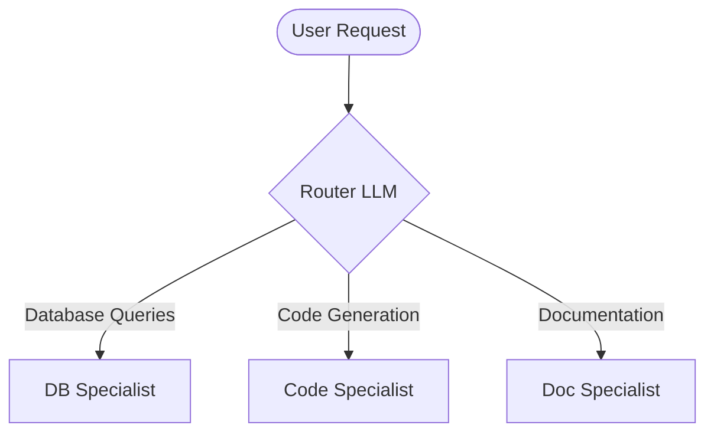
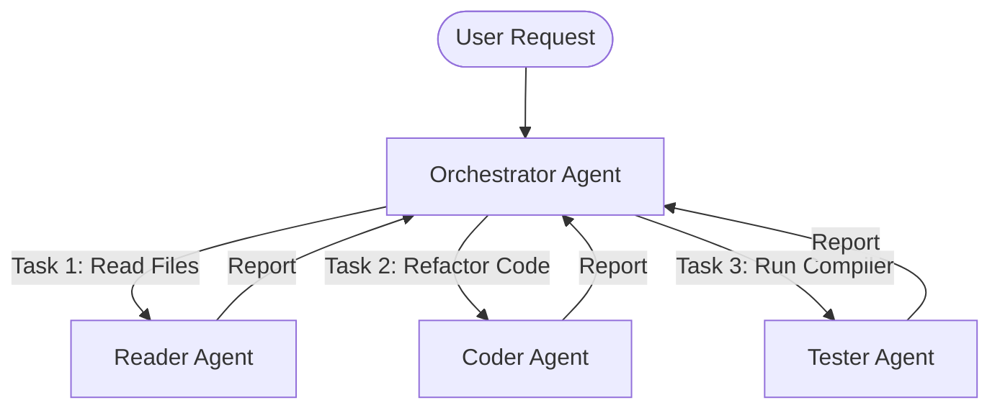

# 🤖 Multi-Agent Design Patterns: Orchestration & Graph Topology

## 🌐 The Shift to Collaborative Intelligence
Single agents struggle when tasked with multi-faceted projects. The "Jack of all trades, master of none" limitation of LLMs is solved by breaking tasks down into a network of specialized collaborative agents. 

However, multi-agent systems introduce distributed synchronization challenges, state mutation conflicts, and communication overhead. This document taxonomizes the modern design patterns for multi-agent architectures.

---

## 🏗️ Core Topologies

### 1. Router Pattern (Dynamic Delegation)
* **Description**: A light, high-speed LLM analyzes the user input and routes the task to a single specialized agent. The router steps out of the loop once the handoff is complete.
* **Best For**: Customer support desks, multi-purpose coding assistants (routing between debugging, documentation, or writing new code).

### 2. Orchestrator-Workers (Centralized Control)
* **Description**: A central Orchestrator plan-creator agent breaks a complex request down into discrete sub-tasks, delegates them to Worker agents in parallel or series, aggregates their individual outputs, and delivers a unified solution.
* **Best For**: Writing full-stack software, producing multi-section research papers.

### 3. Supervisor Pattern (Hierarchical Supervision)
* **Description**: The Supervisor acts as a manager over a local team of agents. The team shares a state. The Supervisor decides which agent should take the next action based on the state graph, and returns output to the user only when the team has collectively solved the issue.
* **Best For**: Multi-agent software engineering teams (Supervisor coordinates Coder, CodeReviewer, and QA Engineer).

---

## 💾 State & Memory Management

In a multi-agent system, how agents share memory is critical:

### A. Shared State (Blackboard Pattern)
* All agents read and write to a single, shared central state graph.
* **Pros**: Simple coordination; any agent can inspect historical operations.
* **Cons**: State contamination. Coder agent might overwrite variables needed by the Tester agent. Requires strict schema validators.

### B. Isolated State (Message Passing)
* Each agent maintains its own private state. Communication happens strictly through structured messages passed between agents.
* **Pros**: High isolation, modular, easily unit-tested.
* **Cons**: Higher latency and token consumption, as historical context must be explicitly serialized and passed in messages.

---

## ⚠️ Distributed Edge Cases & Mitigation Strategies

### 1. Infinite Echo Chambers
* **Problem**: Agent A outputs a result, Agent B critiques it, Agent A refactors, Agent B critiques it again... infinitely looping and burning API credits.
* **Mitigation**: 
  * Hard limit on the maximum state graph steps ($N \le 15$).
  * Introduce a "Satisfied" threshold (e.g., if code compiles successfully, transition to the end node automatically, bypassing Agent B's critique).

### 2. Context Windows & Truncation
* **Problem**: In a long-running, multi-turn system, the shared chat history runs out of space.
* **Mitigation**:
  * **Summarization Edge**: Periodically run an asynchronous summarization step on the oldest $50\%$ of messages, replacing them with a concise system summary chunk.
  * **Memory Pruning**: Evict intermediate scratchpad reasoning messages once the final output for a sub-task is committed.
