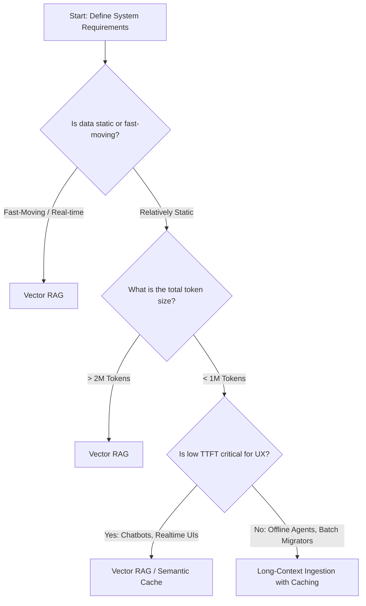

# ⚖️ Architectural Reflection: Advanced RAG vs. Long-Context Windows

## 🎯 The Context Dilemma
With the emergence of LLMs supporting context windows of $1\text{M}$ to $2\text{M}+$ tokens (e.g., Gemini 1.5 Pro, Claude 3.5 Sonnet, GPT-4o), a common architectural question arises: **"Is RAG dead?"**

As a Distributed Systems Engineer, the answer is a definitive **No**. This is a classic trade-off between **Cache Locality, Latency, Cost, and Compute Efficiency**. This note structures my architectural reflections on this comparison.

---

## 📊 Deep-Dive Comparison

| Attribute | Vector RAG (Sparse/Dense) | Long-Context Ingestion |
| :--- | :--- | :--- |
| **Ingestion Latency** | Low/Medium (Chunking, Embedding, Indexing happens async offline) | Extremely High (Must parse and transfer millions of tokens per call) |
| **Inference Latency (TTFT)** | **Excellent** (Typically sub-1s) | **Poor** (Linearly scales with prompt size; can take 5-15s to parse 1M tokens) |
| **Cost Efficiency (Scale)** | **High** (Pay for small token counts matched to query) | **Very Low** (Repeatedly paying for millions of input tokens per chat turn) |
| **Accuracy (Recall)** | Varied (Limited by search quality/embedding precision) | **Near Perfect** (Near 100% recall in "Needle in a Haystack" tests) |
| **Dynamic Updates** | Real-time (Write embeddings instantly to index) | Session-bound (Must resubmit updated context or rely on prompt caching) |

---

## 📈 Latency & Cost Economics (The math)
Let's analyze this from an infrastructure perspective. 

Assume we have a repository codebase size of **500,000 tokens** (approx. 100-150 files).

### Scenario A: Long-Context Model Ingestion
* **Process**: Concatenate all code files and send them in the system prompt.
* **Token Costs (using Claude 3.5 Sonnet pricing)**:
  * Input tokens: $500,000 \times \$3/\text{M} = \$1.50$ per invocation.
  * Without Prompt Caching: If a user sends 10 follow-up questions, that's $10 \times 500,000 = 5\text{M}$ tokens = **\$15.00** total.
  * With Prompt Caching: The first call costs \$1.50, subsequent calls cost \$0.15 (caching read rate: \$0.30/M tokens). Total for 10 turns = $\$1.50 + (9 \times \$0.15) = \$2.85$.
* **TTFT (Time to First Token)**:
  * First call: ~8-12 seconds (Context parsing).
  * Subsequent cached calls: ~1-2 seconds.

### Scenario B: Advanced Hybrid RAG
* **Process**: Parse codebase, embed chunks using an open-source model (e.g., `bge-large-en-v1.5`), index in Qdrant. At query time, retrieve top 15 chunks (~5,000 tokens), rerank, and send to the LLM.
* **Token Costs**:
  * Input tokens: $5,000 \times \$3/\text{M} = \$0.015$ per invocation.
  * 10 follow-up questions: $10 \times \$0.015 = \$0.15$ total.
  * Ingestion costs (one-time embedding computation): Negligible.
* **TTFT**:
  * Consistently sub-1 second.

---

## 🏗️ Architectural Selection Framework

### 🤝 The Hybrid Approach (Best of Both Worlds)
For complex developer toolchains (like my flagship `repo-migrator-agent`), we leverage a split-plane architecture:
1. **The Fast/Control Plane (RAG)**: For quick file searches, semantic lookups, API signature matching, and routing decisions.
2. **The Deep Plane (Long Context)**: When compiling fails and we have a multi-file circular dependency error. The orchestrator pulls *all* related dependency code trees (up to 300k tokens), feeds it directly to a long-context LLM, and lets it perform deep structural refactoring.
