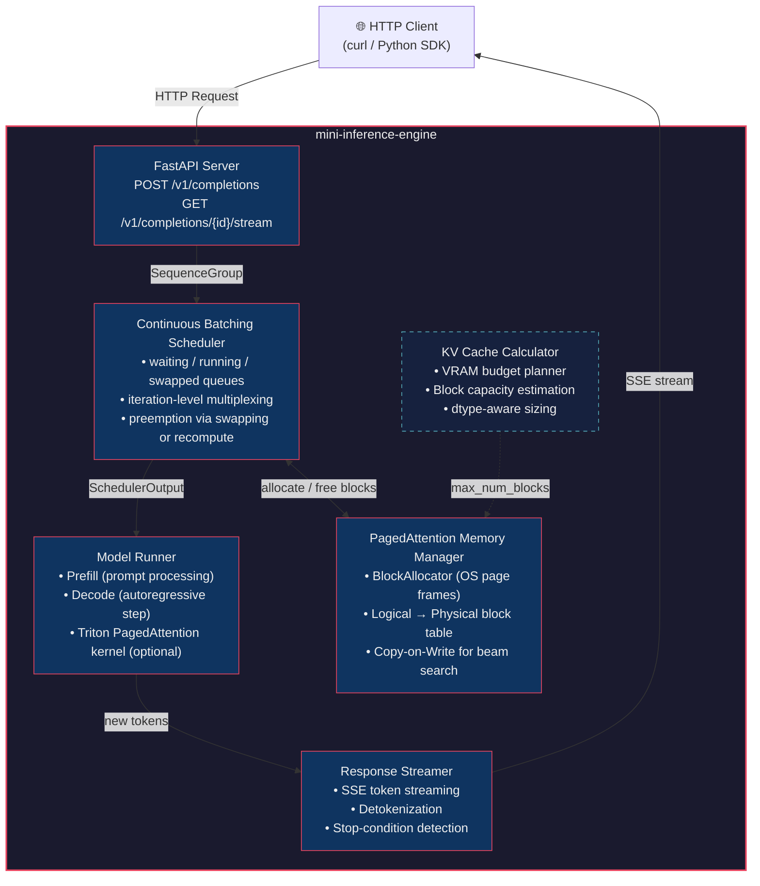

# 🔥 mini-inference-engine: A From-Scratch LLM Serving Engine

> **A pedagogical implementation of PagedAttention, Continuous Batching, and KV Cache management — the core algorithms powering [vLLM](https://github.com/vllm-project/vllm) and [SGLang](https://github.com/sgl-project/sglang).**

---

## Problem Statement: Why Naive LLM Inference Fails at Scale

Large Language Model inference is **memory-bound, not compute-bound**. The dominant bottleneck isn't matrix multiplication — it's the Key-Value (KV) cache that grows linearly with sequence length and must persist across every autoregressive decoding step.

### The Three Failures of Naive Serving

| Failure Mode | Root Cause | Impact |
|---|---|---|
| **Memory Fragmentation** | Pre-allocating contiguous KV cache per request based on `max_seq_len` wastes 60–80% of GPU memory on internal fragmentation | 2–4× fewer concurrent requests than hardware allows |
| **GPU Underutilization** | Static batching pads all sequences to the longest in the batch, then waits for *all* to finish before admitting new work | Throughput collapses to the speed of the slowest request |
| **OOM Cliff** | No graceful degradation — a single long sequence can evict everything | Cascading failures under load |

These aren't hypothetical — they are the exact problems that motivated the [PagedAttention paper (Kwon et al., 2023)](https://arxiv.org/abs/2309.06180) and the creation of vLLM.

**This project implements the solutions from first principles.**

---

## Architecture Overview



### Request Lifecycle

1. **Arrive** — Client sends a prompt via `POST /v1/completions`.
2. **Enqueue** — API server wraps the prompt into a `SequenceGroup` and pushes it to the scheduler's `waiting` queue.
3. **Schedule** — At each iteration, the scheduler:
   - Checks `running` sequences for completion (EOS or max length).
   - Frees blocks for finished sequences.
   - Attempts to admit new requests from `waiting` by allocating blocks.
   - If memory is exhausted, *preempts* the lowest-priority running sequence (swap to CPU or recompute).
4. **Execute** — The model runner receives a `SchedulerOutput` containing the batch of sequences to process and their block tables.
5. **Decode** — One forward pass produces the next token for *every* active sequence in the batch.
6. **Stream** — New tokens are pushed to clients via Server-Sent Events.
7. **Repeat** — Steps 3–6 repeat every iteration until all sequences finish.

---

## Technical Highlights

### 1. PagedAttention Memory Manager (`engine/kv_cache.py`)

The core insight: **treat GPU KV cache memory like an OS manages RAM**.

| OS Concept | KV Cache Analog |
|---|---|
| Virtual page | Logical KV block (a sequence's view of its cache) |
| Physical page frame | Physical KV block (actual GPU memory) |
| Page table | Block table mapping logical → physical |
| `fork()` / Copy-on-Write | Beam search candidate sharing |
| Page fault | Allocate new physical block on demand |

**Key formula for block budget:**

$$
\text{total\_blocks} = \left\lfloor \frac{\text{gpu\_memory\_for\_kv}}{\text{block\_size} \times \text{num\_layers} \times 2 \times \text{num\_kv\_heads} \times \text{head\_dim} \times \text{dtype\_size}} \right\rfloor
$$

The factor of 2 accounts for both Key and Value tensors.

### 2. Continuous Batching Scheduler (`engine/scheduler.py`)

Static batching wastes GPU cycles waiting for the longest sequence in a batch to finish. Continuous batching operates at **iteration granularity**:

- **Every forward pass**, the scheduler re-evaluates which sequences to include.
- Finished sequences are **immediately ejected** and their memory is reclaimed.
- New requests are **admitted mid-batch** without waiting for an entire batch to drain.

This yields **2–3× throughput improvement** over static batching at high concurrency.

**Three-queue state machine:**

```
                    ┌──────────┐
   new request ───→ │ WAITING  │
                    └────┬─────┘
                         │ blocks allocated
                         ▼
                    ┌──────────┐
                    │ RUNNING  │ ←── swapped back in
                    └──┬───┬───┘
           finished │  │   │ preempted (OOM)
                    ▼  │   ▼
                  done │ ┌──────────┐
                       │ │ SWAPPED  │ (KV cache on CPU)
                       │ └──────────┘
                       ▼
                    output
```

### 3. KV Cache Calculator (`engine/memory_calculator.py`)

A mathematical VRAM budget planner that answers:

- *"How much memory does the KV cache need for N concurrent sequences of length L?"*
- *"After loading Llama-3-70B in FP16, how many blocks fit in my remaining 60 GB?"*
- *"What's the max batch size I can sustain at 4096 context length?"*

Supports FP16, BF16, FP8, and INT8 quantized KV caches.

### 4. Benchmarking Suite (planned)

Compare three serving strategies on identical workloads:

| Strategy | Description | Expected Result |
|---|---|---|
| **Naive** | One request at a time, pre-allocated cache | Baseline (1×) |
| **Paged** | PagedAttention memory manager, static batch | ~1.5× throughput |
| **Continuous + Paged** | Full engine with continuous batching | ~2.5× throughput |

Metrics: tokens/sec, time-to-first-token (TTFT), p50/p99 latency, GPU memory utilization.

---

## Directory Structure

```
mini-inference-engine/
├── README.md                       # ← You are here
├── pyproject.toml                  # Project metadata and dependencies
│
├── engine/
│   ├── __init__.py
│   ├── kv_cache.py                 # BlockAllocator + KVCacheManager (PagedAttention)
│   ├── scheduler.py                # Continuous Batching Scheduler
│   ├── memory_calculator.py        # VRAM budget calculator
│   ├── model_runner.py             # Model execution wrapper (planned)
│   ├── sequence.py                 # Sequence and SequenceGroup dataclasses (planned)
│   └── config.py                   # Engine configuration (planned)
│
├── api/
│   ├── __init__.py
│   ├── server.py                   # FastAPI application (planned)
│   └── protocol.py                 # Request/Response schemas (planned)
│
├── kernels/
│   └── paged_attention.py          # Triton PagedAttention kernel (planned)
│
├── benchmarks/
│   ├── bench_naive.py              # Naive baseline (planned)
│   ├── bench_paged.py              # Paged-only benchmark (planned)
│   └── bench_continuous.py         # Full engine benchmark (planned)
│
└── tests/
    ├── test_kv_cache.py            # Unit tests for block allocator
    ├── test_scheduler.py           # Unit tests for scheduler
    └── test_memory_calculator.py   # Unit tests for calculator
```

---

## Tech Stack

| Component | Technology | Rationale |
|---|---|---|
| Language | **Python 3.11+** | Industry standard for ML infrastructure |
| Tensor Library | **PyTorch 2.x** | GPU memory management, tensor ops |
| GPU Kernels | **Triton** (optional) | Custom PagedAttention kernel without CUDA |
| API Server | **FastAPI** | Async, SSE streaming, OpenAPI docs |
| Testing | **pytest** | Property-based testing for allocator invariants |
| Typing | **mypy** / **pyright** | Full static type coverage |

---

## Quick Start

```bash
# Clone and install
git clone https://github.com/YOUR_USERNAME/mini-inference-engine.git
cd mini-inference-engine
pip install -e ".[dev]"

# Run the memory calculator to see VRAM breakdown for Llama-3-8B
python -m engine.memory_calculator \
    --num-layers 32 \
    --num-kv-heads 8 \
    --head-dim 128 \
    --dtype fp16 \
    --gpu-memory-gb 24 \
    --model-size-gb 16

# Run tests
pytest tests/ -v

# Start the server (planned)
# uvicorn api.server:app --host 0.0.0.0 --port 8000
```

---

## Key References

1. **Kwon, W. et al.** (2023). *Efficient Memory Management for Large Language Model Serving with PagedAttention*. SOSP '23. [arXiv:2309.06180](https://arxiv.org/abs/2309.06180)
2. **Yu, G. et al.** (2022). *Orca: A Distributed Serving System for Transformer-Based Generative Models*. OSDI '22. — The paper that introduced continuous (iteration-level) batching.
3. **Pope, R. et al.** (2023). *Efficiently Scaling Transformer Inference*. MLSys '23. [arXiv:2211.05102](https://arxiv.org/abs/2211.05102)
4. **Agrawal, A. et al.** (2024). *Taming Throughput-Latency Tradeoff in LLM Inference with Sarathi-Serve*. OSDI '24. [arXiv:2403.02310](https://arxiv.org/abs/2403.02310)
5. **Zheng, L. et al.** (2024). *SGLang: Efficient Execution of Structured Language Model Programs*. [arXiv:2312.07104](https://arxiv.org/abs/2312.07104)

---

## Why This Project Matters

This is not a tutorial or a toy. It is a **ground-up implementation** of the algorithms that power production LLM serving at companies like Anyscale, Databricks, and every major cloud provider's AI inference API.

Building this demonstrates:

- **Systems engineering** — OS-level memory management concepts (paging, virtual memory, CoW) applied to GPU memory.
- **Scheduler design** — Real-time scheduling under resource constraints with preemption policies.
- **Performance analysis** — Mathematical modeling of memory budgets and throughput bottlenecks.
- **Production architecture** — Clean separation of concerns: scheduler, memory manager, model runner, API layer.

> *This project represents Staff-level systems engineering translated to AI infrastructure — the ability to reason about memory hierarchies, scheduling policies, and resource management at the level required to build and operate large-scale ML serving systems.*

---

## License

MIT
