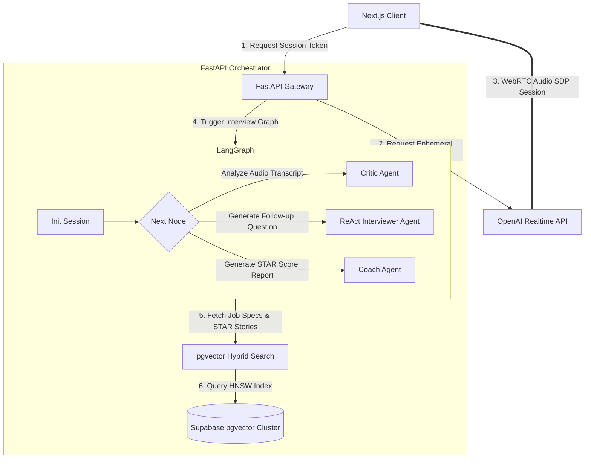

# 🎙️ Flagship Project: `prepHub-orchestrator`

> A production-grade, low-latency AI-Powered Interview Orchestrator that powers **PrepHub**. It features **OpenAI Realtime (WebRTC) Session Management**, a stateful **LangGraph Multi-Agent Interview Graph**, and a secure **pgvector Hybrid Search engine**.

---

## 🏗️ Advanced AI Systems Architecture

This orchestrator handles the transition from standard asynchronous text interfaces to **sub-500ms conversational audio** and robust multi-agent critiquing.

---

## 📂 Directory Structure

* `realtime/`: Core modules for managing live voice interfaces.
  * `session.py`: FastAPI routes to generate secure, ephemeral OpenAI Realtime WebRTC session tokens.
* `agents/`: The complete multi-agent LangGraph interview coordinator.
  * `graph.py`: State graph declarations, token logging, memory persistence, and grading criteria nodes.
  * `interviewer.py`: ReAct-based dynamic interviewer capable of executing DuckDuckGo search to extract deep-dive corporate metrics.
  * `critic.py`: Real-time conversation auditor tracking communication gaps.
* `rag/`: Vector retrieval systems.
  * `retriever.py`: High-performance `pgvector` hybrid-search engine with active user session pre-filtering.

---

## ⚡ Technical Highlights (Staff-Level Proof)

1. **Sub-500ms Audio Latency (WebRTC)**:
   Instead of the traditional "Record Audio -> Transcribe (Whisper) -> Generate Text (GPT-4) -> Text-to-Speech (TTS)" cascade (which takes 3-5 seconds and feels disjointed), the orchestrator opens a direct **WebRTC Peer Connection** to OpenAI. Audio is streamed, processed, and responded to natively, achieving real-time conversation flows.
2. **Dynamic ReAct Interviewer with AST/Web Tooling**:
   The `InterviewerAgent` is not pre-prompted with static lists of questions. It leverages autonomous search tools to look up real-time news and stack architectures of the target company (e.g., searching for "latest Qdrant updates" or "Shopify engineering blog posts") to formulate hyper-tailored, realistic system design scenarios.
3. **Optimized pgvector Search**:
   Utilizes Postgres `pgvector` with **HNSW (Hierarchical Navigable Small World)** indexing and L2 distance calculations, coupled with secure row-level security pre-filtering to prevent cross-tenant vector contamination.
