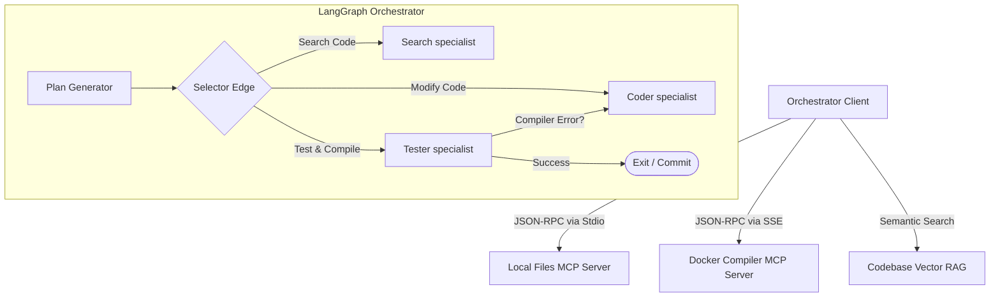

# 🛠️ Flagship Project: `repo-migrator-agent`

> An autonomous, self-correcting multi-agent system powered by **Model Context Protocol (MCP)**, **LangGraph**, and **Hybrid RAG** designed to automate large-scale codebase migrations, API upgrades, and architectural refactoring.

---

## 🏗️ Architecture Overview

The system consists of a centralized, stateful coordinator orchestrating several specialized agents, utilizing local and remote MCP servers to read code, edit files, compile, run tests, and self-correct based on error tracebacks.



---

## 📂 Directory Layout

* `mcp-servers/`: Custom MCP servers exposing codebase manipulation tools.
  * `mcp-server-fs`: Extended local filesystem tools with AST parsing, token limits, and regex searching.
  * `mcp-server-docker-compiler`: A sandboxed execution environment to securely run `npm run build`, `pytest`, or compiler checks.
* `orchestrator/`: The core LangGraph state graph and agent coordination engines.
  * `graph.py`: State graph wiring, node actions, conditional edges, and persistence layer.
  * `agents.py`: LLM agent definitions (System prompts, prompt templates, structured output models).
  * `config.py`: Local and remote setup configuration.

---

## ⚡ Key Technical Features

1. **AST-Aware File Reads**: Instead of reading a massive 2,000-line file as raw text, the Files MCP Server parses the Abstract Syntax Tree (AST) to return only specific classes, functions, or imports requested by the model, optimizing token budgets.
2. **Deterministic Sandboxed Execution**: All compilation and test runs happen inside short-lived Docker containers via the Compiler MCP Server, keeping developer machines clean and preventing arbitrary code execution exploits.
3. **Stateful Self-Correction Loop**: When tests fail, the compiler logs, tracebacks, and source lines are returned to the state graph. The `CoderAgent` analyzes the error, updates its internal plan, and performs another edit recursively until compilation succeeds.
4. **Human-in-the-Loop Diff Gate**: Before files are committed to disk or pushed to git, the orchestrator pauses execution and generates a clean diff file for review and approval.

---

## 🚀 Execution Guide (Roadmap)

### Step 1: Initialize MCP Servers
```bash
cd mcp-servers/mcp-server-fs && npm install && npm run build
cd ../mcp-server-docker-compiler && pip install -r requirements.txt
```

### Step 2: Configure Environment
Create `.env` file in the orchestrator directory:
```env
OPENAI_API_KEY=your-key
ANTHROPIC_API_KEY=your-key
QDRANT_URL=http://localhost:6333
```

### Step 3: Run Orchestrator
```bash
python orchestrator/main.py --target-dir /path/to/target-repo --migration-spec migrations/v1-to-v2.json
```
