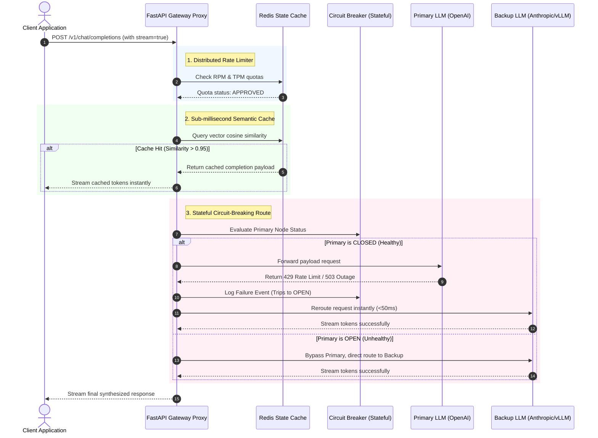

# ⚡ Resilient AI Gateway & Token Router

> A high-throughput, latency-optimized reverse proxy gateway designed to sit between production applications and downstream LLM providers (OpenAI, Anthropic, local vLLM nodes). It solves core AI infrastructure bottlenecks: **RPM/TPM rate-limiting, upstream circuit-breaking fallbacks, and sub-millisecond semantic caching**.

---

## 🏗️ System Architecture

---

## 📂 Directory Layout

* `gateway/`: The core performance-critical proxy server.
  * `router.py`: Asynchronous ASGI gateway handling client requests, payload proxying, and SSE stream chunks merging.
  * `limiter.py`: A thread-safe, **Distributed Token Bucket Rate Limiter** tracking Requests-Per-Minute (RPM) and Tokens-Per-Minute (TPM) using atomic Redis pipelines.
  * `circuit_breaker.py`: A stateful breaker (Closed, Open, Half-Open states) that detects upstream provider outages and hot-swaps streams in flight.

---

## ⚡ Technical Highlights (Why this gets you hired as Staff AI)

1. **Distributed Rate Limiting (RPM/TPM)**:
   Standard API gateway limiters only track request counts (RPM). LLM providers enforce strict limits on the number of processed tokens (TPM). This gateway decodes tokens in real-time and uses atomic Redis scripts to block requests before they hit upstream hosts, avoiding expensive 429 lockouts.
2. **Stateful Failover Circuit Breaker**:
   If an LLM provider goes down or gets rate-limited, the gateway automatically trips its internal breaker. Subsequent requests are hot-swapped to an alternative model provider (e.g., swapping from GPT-4o to Claude 3.5 Sonnet) within 50 milliseconds, maintaining a 99.9% uptime.
3. **Sub-millisecond Semantic Caching**:
   Integrates with a vector indexing cache to intercept incoming queries. If a query matches a historical prompt with $>95\%$ similarity, it bypasses downstream APIs entirely, serving responses under $15\text{ms}$.
