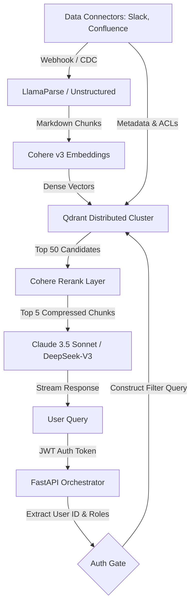
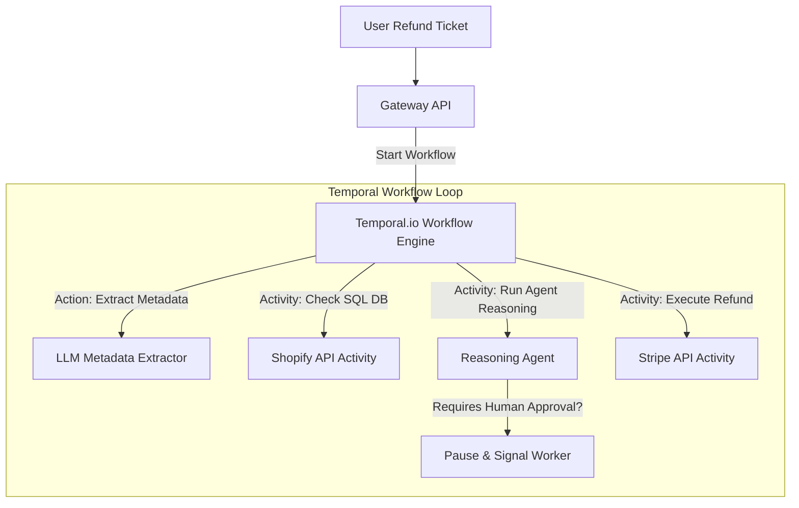

# 📐 AI System Design Playbook (Staff Level)

## 🏛️ System Design Framework for Applied AI
Staff-level AI System Design interviews do not just ask "What prompt would you write?" They test your ability to build **scalable, cost-effective, deterministic, and secure software architectures** around non-deterministic foundation models. 

Use this unified 5-step framework for every design query:
1. **Requirements & Constraints**: Ingestion scale, query throughput (QPS), latency requirements (TTFT vs. total generation), compliance (PII filtering, SOC2, GDPR), budget ($/day limits).
2. **Data & Vector Pipeline Architecture**: Chunking philosophy, ingestion trigger (event-driven vs. batch), vector indexing strategy, sparse/dense fusion, reranking layers.
3. **Execution Model (Control Plane)**: Single agent vs. multi-agent graph, state persistence, orchestration engine (LangGraph, Temporal), fallback heuristics.
4. **Ops, Evaluation & Safety**: LLM-as-a-judge metrics (faithfulness, relevancy), monitoring (LangSmith traces), guardrails (LlamaGuard, NeMo), prompt cache optimizations.
5. **Trade-offs & Scalability Bottlenecks**: Cost projections, API rate-limiting handling, local small-model hosting (Ollama/vLLM) vs. cloud-hosted APIs.

---

## 🏗️ Mock Design 1: Enterprise-Grade RAG at Scale

### 🎯 Objective
Design a document retrieval and question-answering system for a global enterprise containing $10\text{M}$ documents (PDFs, Confluence pages, Slack archives), with real-time permissions filtering, a strict sub-second TTFT constraint, and a \$1,000/day budget cap.

### 🛠️ Architecture Blueprint

### 🧠 Critical Staff-Level Deep Dives
* **Real-time Permissions Filter (Document ACLs)**:
  * **Mistake**: Retrieving documents and then filtering out unauthorized chunks. (Leaks semantic info, ruins recall).
  * **Solution**: Pre-filtering. Ingest Active Directory/Okta security groups alongside document embeddings. At query time, extract the user's groups from their JWT token and construct a metadata filter block `(group IN user_groups)` applied *directly* inside Qdrant's vector search query.
* **Optimizing for sub-second TTFT**:
  * Implement **Semantic Caching** using Redis. If a query matches a cached question with $>0.96$ cosine similarity, return the cached answer instantly ($<15\text{ms}$).
  * Leverage **Prompt Caching** by placing static company policies and system instructions at the beginning of the context block.
  * Use **Streaming Response** to output tokens immediately, improving perceived latency.

---

## 🏗️ Mock Design 2: Resilient E-Commerce Auto-Refund Agent

### 🎯 Objective
Design an autonomous customer agent that processes refund requests. It must verify purchase history in Shopify, call Stripe to check refund status, make complex decisions based on terms of service, and invoke refund actions. The agent must handle system crashes elegantly and ensure **zero duplicate payments**.

### 🛠️ Architecture Blueprint

### 🧠 Critical Staff-Level Deep Dives
* **Distributed Transactions & Idempotency**:
  * **Mistake**: Running an LLM inside a loop that calls Stripe directly. If Stripe times out, the LLM might retry the tool call, causing duplicate transactions.
  * **Solution**: Run the LLM agent inside a **Temporal.io** state engine. Expose Stripe as a strictly **idempotent Temporal Activity**. Generate a unique idempotency token (e.g., `refund-uuid-user-order-id`) *before* executing the Stripe call. Temporal guarantees that even if the server crashes mid-refund, it resumes and retries the API call using the exact same idempotency token, avoiding duplicate transactions.
* **Human-in-the-Loop Thresholds**:
  * If the refund amount is $<\$50$ and risk score is low, automate the transaction.
  * If refund amount is $\ge\$50$, trigger a Temporal Signal, sending an approval message to Slack. Pause execution indefinitely without consuming server memory, and resume immediately when the manager clicks "Approve".
